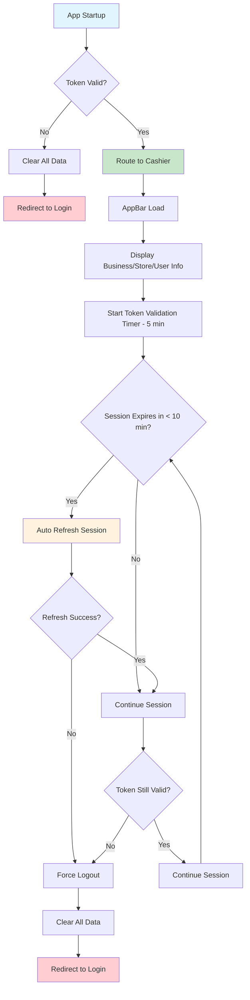
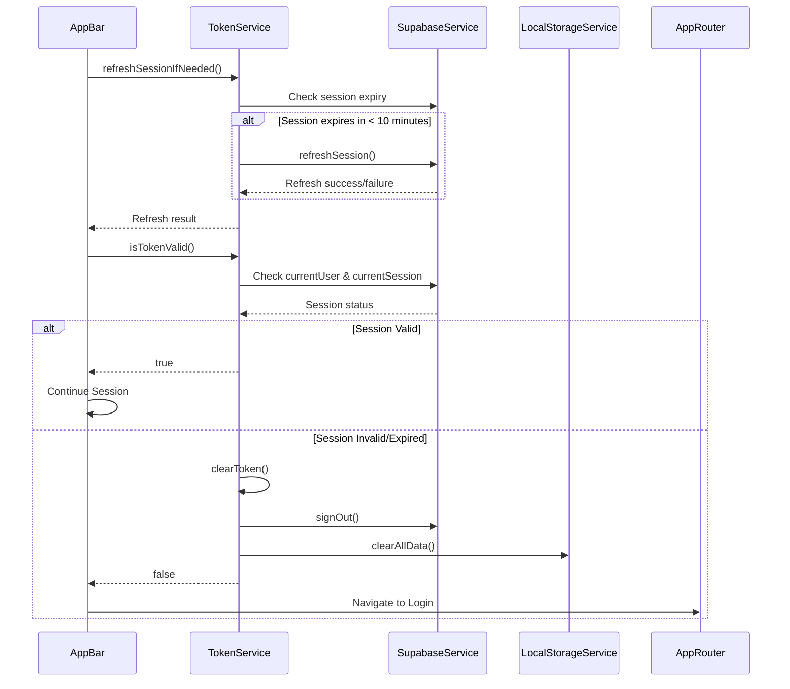
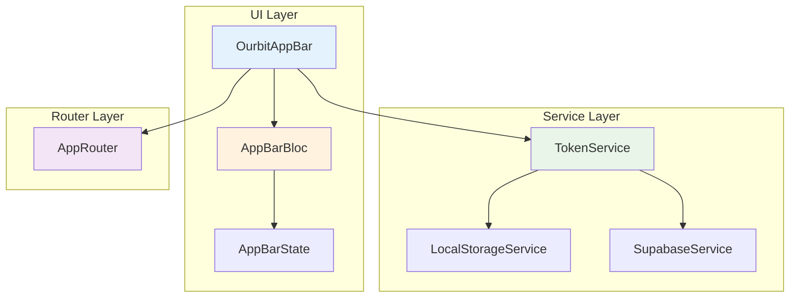
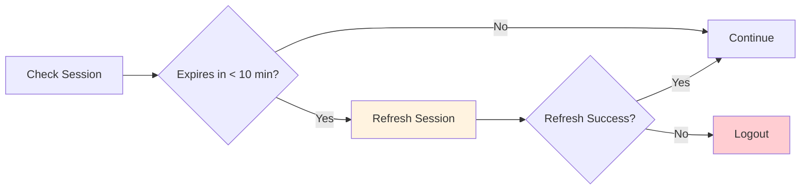
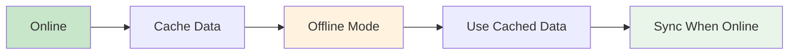
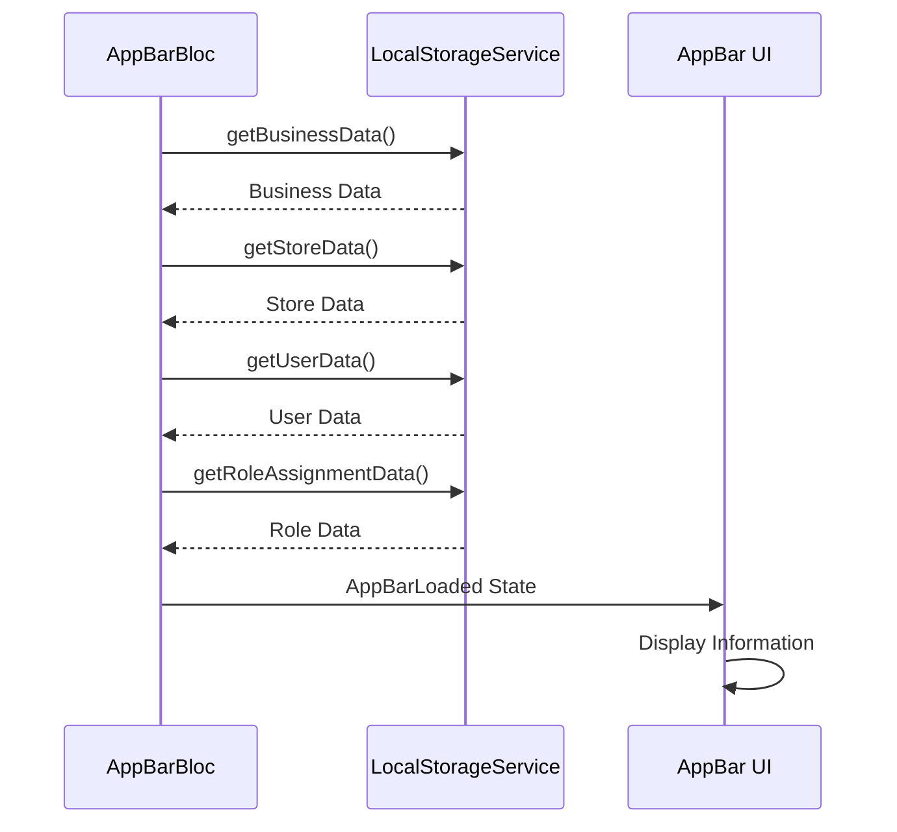
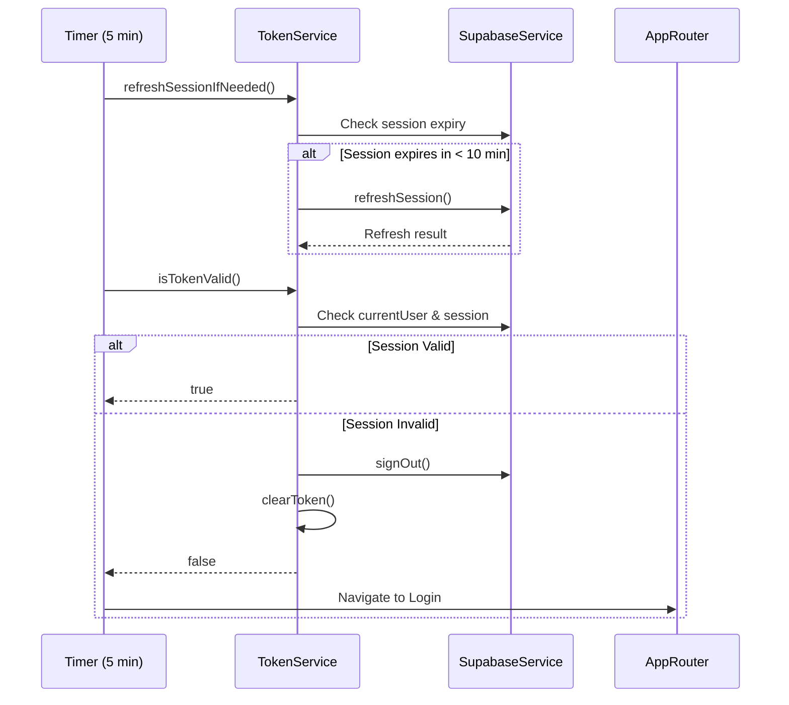

# Sistem Autentikasi Ourbit POS

## Overview

Dokumen ini menjelaskan sistem autentikasi Ourbit POS yang mencakup validasi token otomatis, pengecekan status autentikasi di AppBar, dan support untuk aplikasi offline. Sistem telah diperbaiki untuk mengatasi masalah logout otomatis dengan menambahkan refresh session otomatis dan validasi yang lebih akurat.

## Flow Diagram

```
App Startup → Check Token → Valid → Route to Cashier
     ↓           ↓         ↓
   Invalid    Expired   Network Error
     ↓           ↓         ↓
   Clear Data → Logout → Redirect to Login
```

## Authentication Flow Diagram



## Token Validation Flow



## Session Management Improvements

### Auto Refresh Mechanism

```dart
// Check if session will expire in the next 10 minutes
if (session.expiresAt != null) {
  final expiryTime = DateTime.fromMillisecondsSinceEpoch(session.expiresAt!);
  final now = DateTime.now();
  final timeUntilExpiry = expiryTime.difference(now);

  // If session expires in less than 10 minutes, try to refresh
  if (timeUntilExpiry.inMinutes < 10) {
    await SupabaseService.client.auth.refreshSession();
    return true;
  }
}
```

### Improved Token Validation

```dart
static Future<bool> isTokenValid() async {
  try {
    // First check if Supabase session is still valid
    final user = SupabaseService.client.auth.currentUser;
    if (user == null) {
      await clearToken();
      return false;
    }

    // Check if session is still valid
    final session = SupabaseService.client.auth.currentSession;
    if (session == null) {
      await clearToken();
      return false;
    }

    // Check if session is expired
    if (session.expiresAt != null &&
        DateTime.fromMillisecondsSinceEpoch(session.expiresAt!).isBefore(DateTime.now())) {
      await clearToken();
      return false;
    }

    return true;
  } catch (e) {
    await clearToken();
    return false;
  }
}
```

## AppBar Information Display

### Layout Structure

```
┌─────────────────────────────────────────────────────────────┐
│ [Business Name]                    [User Name] [Avatar]   │
│ [Store Name]                       [User Role]            │
└─────────────────────────────────────────────────────────────┘
```

### Data Sources

1. **Business Name**: `business_data.name` → Default "Allnimall Pet Shop"
2. **Store Name**: `store_data.name` → Default "Toko"
3. **User Name**: `user_data.name` → `user_data.email` prefix → Default "User"
4. **User Role**: `role_assignment_data.role.name` → Default "User"

## Component Architecture



## Token Management

### Token Storage

```dart
// Token stored in SharedPreferences
const String _tokenKey = 'auth_token';
const String _tokenExpiryKey = 'token_expiry';
```

### Token Validation Process

1. **Auto Refresh Check**: Check if session expires in < 10 minutes
2. **Refresh Session**: Automatically refresh if needed
3. **Check Supabase Session**: Verify current user and session
4. **Check Session Expiry**: Validate session hasn't expired
5. **Offline Fallback**: Use cached validation for offline scenarios

### Token Validation Frequency

- **AppBar**: Every 5 minutes (reduced from 30 seconds)
- **App Startup**: On initial load
- **Route Changes**: On navigation

## Session Refresh Strategy

### Proactive Refresh



### Benefits

1. **Prevents Unexpected Logouts**: Session refreshed before expiry
2. **Better User Experience**: No interruption during work
3. **Reduced API Calls**: Only refresh when needed
4. **Improved Security**: Maintains session integrity

## Offline Support

### Cached Data Strategy



### Offline Features

1. **Cached User Data**: Display user info from local storage
2. **Cached Business/Store Data**: Show business/store info
3. **Graceful Degradation**: Continue working with cached data
4. **Auto Sync**: Sync when connection restored

## Error Handling

### Token Validation Errors

```dart
// Error handling in token validation
try {
  // First try to refresh session if needed
  await TokenService.refreshSessionIfNeeded();

  // Then check if token is still valid
  final isValid = await TokenService.isTokenValid();
  if (!isValid) {
    await _handleInvalidToken();
  }
} catch (e) {
  // Network error or other issues
  await _handleInvalidToken();
}
```

### Force Logout Process

1. **Clear Supabase Session**: Sign out from Supabase
2. **Clear Local Token**: Remove token from storage
3. **Clear All Data**: Remove all cached data
4. **Navigate to Login**: Redirect to login page

## Data Flow

### AppBar Data Loading



### Token Validation Flow



## Security Considerations

### Token Security

1. **Secure Storage**: Tokens stored in SharedPreferences
2. **Automatic Expiry**: Tokens automatically cleared when expired
3. **Regular Validation**: Tokens validated every 5 minutes
4. **Proactive Refresh**: Session refreshed before expiry
5. **Force Logout**: Complete data clearing on invalid token

### Data Protection

1. **Local Data Encryption**: Sensitive data encrypted in storage
2. **Session Management**: Proper session handling with Supabase
3. **Error Handling**: Secure error messages without data exposure
4. **Offline Security**: Cached data protected from unauthorized access

## Implementation Details

### TokenService Methods

```dart
class TokenService {
  // Refresh session if needed (new)
  static Future<bool> refreshSessionIfNeeded()

  // Check if stored token is valid (improved)
  static Future<bool> isTokenValid()

  // Get token from storage
  static Future<String?> getStoredToken()

  // Clear token from storage
  static Future<void> clearToken()

  // Force logout and clear all data
  static Future<void> forceLogout()

  // Handle token from URL (web only)
  static Future<bool> handleTokenFromUrl()
}
```

### AppBar Integration

```dart
class OurbitAppBar extends StatefulWidget {
  // Token validation timer (reduced frequency)
  Timer? _tokenValidationTimer;

  // Start periodic validation (5 minutes)
  void _startTokenValidation()

  // Validate token with refresh
  Future<void> _validateToken()

  // Handle invalid token
  Future<void> _handleInvalidToken()
}
```

### AppBarBloc Data Loading

```dart
class AppBarBloc extends Bloc<AppBarEvent, AppBarState> {
  // Load data from local storage
  Future<void> _onLoadAppBarData()

  // Refresh data
  Future<void> _onRefreshAppBarData()
}
```

## Default Routing

### App Startup Flow

1. **Initial Route**: `/` (root)
2. **Token Check**: Validate stored token
3. **Valid Token**: Redirect to `/pos` (Cashier)
4. **Invalid Token**: Redirect to `/login`

### Route Configuration

```dart
static final GoRouter router = GoRouter(
  initialLocation: '/',
  redirect: (context, state) async {
    // Check authentication
    final isAuthenticated = await SupabaseService.isUserAuthenticated();
    if (isAuthenticated) {
      if (state.matchedLocation == '/') {
        return posRoute; // Default to Cashier
      }
      return null; // Allow access
    }
    return loginRoute; // Redirect to login
  },
);
```

## Testing Scenarios

### Happy Path

1. **Valid Token**: App starts → Route to Cashier → AppBar shows info
2. **Token Validation**: AppBar validates token every 5min → Continue session
3. **Auto Refresh**: Session refreshed before expiry → No logout
4. **Offline Mode**: App works with cached data → Sync when online

### Error Scenarios

1. **Invalid Token**: AppBar detects invalid token → Force logout → Login
2. **Expired Token**: TokenService detects expiry → Clear data → Login
3. **Refresh Failure**: Auto refresh fails → Force logout → Login
4. **Network Error**: Graceful fallback to cached data

### Edge Cases

1. **Token Expiry During Session**: AppBar detects → Auto refresh → Continue
2. **Multiple Invalid Tokens**: Prevent multiple logout calls
3. **App Background/Foreground**: Resume token validation
4. **Network Intermittent**: Handle connection changes

## Performance Considerations

### Optimization Strategies

1. **Proactive Refresh**: Reduce unexpected logouts
2. **Reduced Validation Frequency**: 5 minutes instead of 30 seconds
3. **Cached Validation**: Reduce API calls with cached results
4. **Timer Management**: Proper timer cleanup to prevent memory leaks

### Memory Management

1. **Timer Cleanup**: Cancel timers on widget disposal
2. **State Management**: Proper state cleanup on logout
3. **Data Cleanup**: Clear all data on logout
4. **Resource Management**: Efficient resource usage

## Maintenance Notes

### Error Logging

- Log all token validation errors
- Track logout frequency and reasons
- Monitor session refresh success/failure rates
- Log network connectivity issues

### Data Consistency

- Ensure data consistency between online and offline
- Handle data conflicts gracefully
- Maintain data integrity during sync
- Validate data before display

### User Experience

- Provide clear feedback during validation
- Handle loading states gracefully
- Show appropriate error messages
- Maintain smooth navigation flow

## Recent Improvements (v2.0)

### Session Management

1. **Auto Refresh**: Session automatically refreshed before expiry
2. **Improved Validation**: Check Supabase session instead of just stored token
3. **Reduced Frequency**: Validation every 5 minutes instead of 30 seconds
4. **Better Error Handling**: More robust error handling and recovery

### Performance

1. **Fewer API Calls**: Reduced validation frequency
2. **Proactive Refresh**: Prevents unexpected logouts
3. **Better Caching**: Improved local data management
4. **Memory Optimization**: Better timer and resource management

### Security

1. **Session Integrity**: Proper session validation
2. **Secure Refresh**: Safe session refresh mechanism
3. **Data Protection**: Enhanced data clearing on logout
4. **Error Recovery**: Graceful handling of authentication errors

## Future Enhancements

### Planned Features

1. **Biometric Authentication**: Add fingerprint/face ID support
2. **Multi-Factor Authentication**: Implement 2FA
3. **Advanced Session Management**: More sophisticated session handling
4. **Offline Sync**: Improved offline data synchronization

### Technical Improvements

1. **Token Refresh**: Further optimization of refresh mechanism
2. **Caching Strategy**: Advanced caching with TTL
3. **Security Enhancements**: Additional security measures
4. **Performance Optimization**: Further performance improvements
