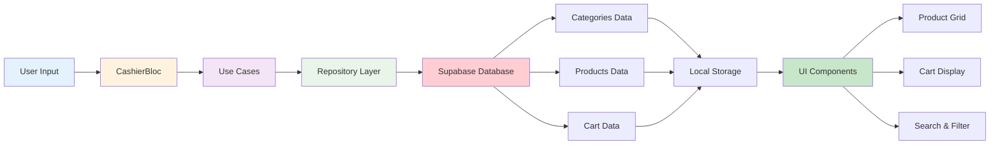
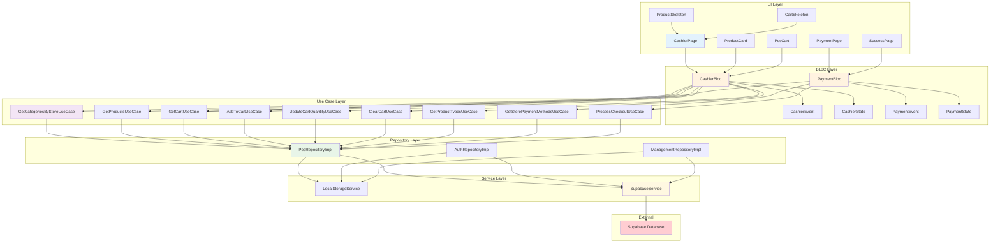
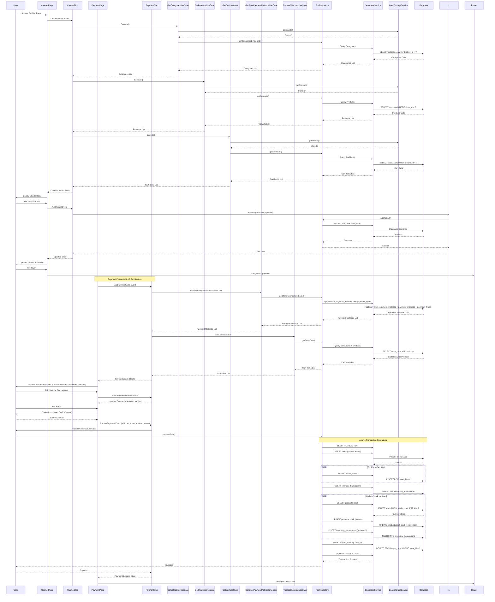
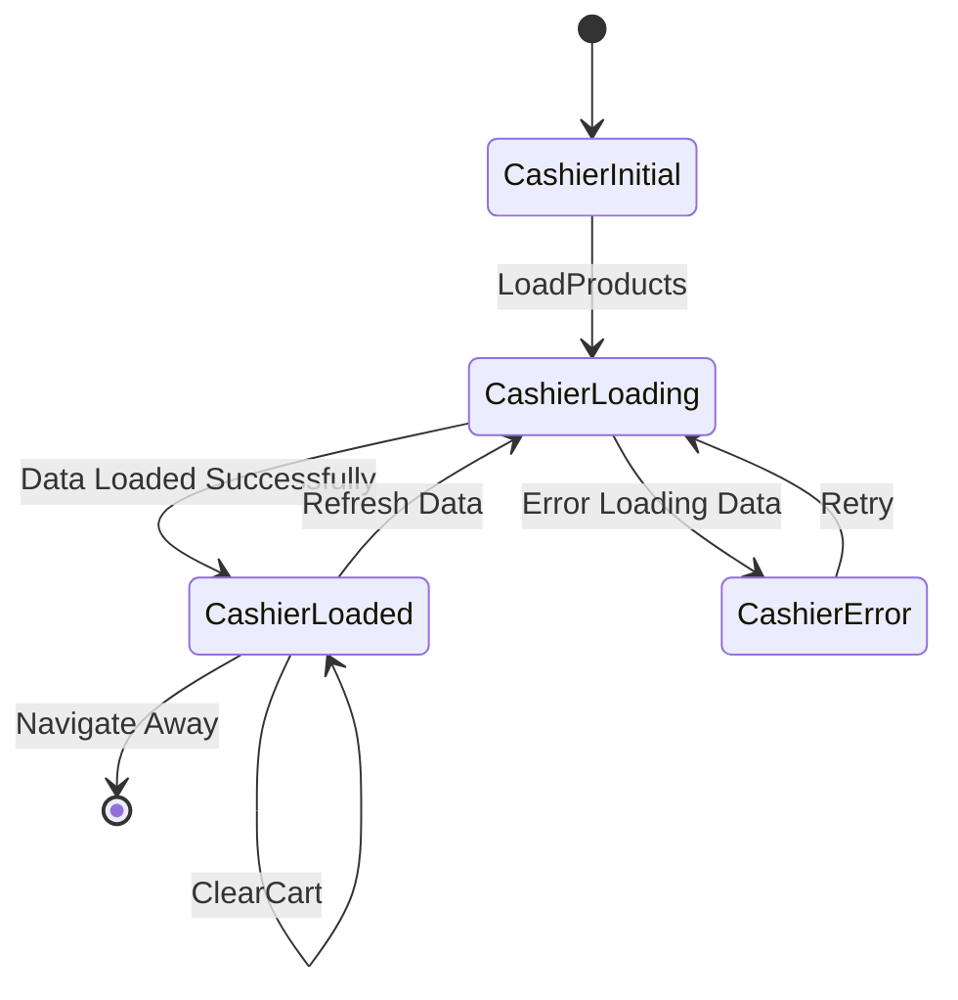
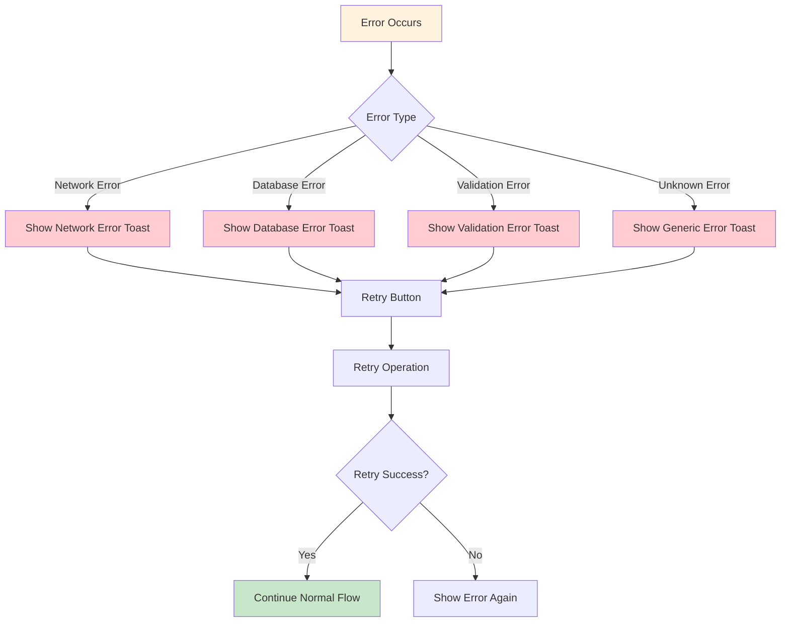

# Flow Cashier Page Ourbit POS

## Overview

Dokumen ini menjelaskan alur dan implementasi halaman Cashier (POS) aplikasi Ourbit POS yang mencakup loading data, interaksi user, dan operasi cart dengan micro animation dan widget custom.

## Flow Diagram

```
App Load → Load Categories → Load Products → Load Cart → Display UI
     ↓              ↓              ↓           ↓
   Store ID    Categories    Products    Cart Items
     ↓              ↓              ↓           ↓
   Valid?       Found?        Found?      Found?
     ↓              ↓              ↓           ↓
   Yes → Load    Yes → Load   Yes → Load  Yes → Display
   No → Error    No → Empty   No → Empty  No → Empty
```

## Detailed Flowchart

```mermaid
flowchart TD
    A[User Access Cashier Page] --> B{Check Store ID}
    B -->|Store ID Valid| C[LoadCategories Event]
    B -->|Store ID Invalid| D[Show Error: Store Not Found]

    C --> E[GetCategoriesByStoreUseCase]
    E --> F[Query Categories by Store ID]
    F --> G{Categories Found?}

    G -->|Yes| H[LoadProducts Event]
    G -->|No| I[Show Empty Categories State]

    H --> J[GetProductsUseCase]
    J --> K[Query Products by Store ID]
    K --> L{Products Found?}

    L -->|Yes| M[LoadCart Event]
    L -->|No| N[Show Empty Products State]

    M --> O[GetCartUseCase]
    O --> P[Query Cart Items by Store ID]
    P --> Q{Cart Items Found?}

    Q -->|Yes| R[Display CashierLoaded State]
    Q -->|No| S[Show Empty Cart State]

    R --> T[User Interaction]
    T --> U[Add To Cart]
    T --> V[Update Quantity]
    T --> W[Remove From Cart]
    T --> X[Clear Cart]
    T --> Y[Process Payment]

    U --> Z[AddToCartUseCase]
    V --> AA[UpdateCartQuantityUseCase]
    W --> BB[RemoveFromCartUseCase]
    X --> CC[ClearCartUseCase]
    Y --> DD[Navigate to Payment]
    DD --> EE1[Payment Page: Pilih Metode Pembayaran]
    EE1 --> EE2[Input Sales Draft (Catatan)]
    EE2 --> EE3[Proses Pembayaran]
    EE3 --> EE4[Update Stock & Catat Penjualan]
    EE4 --> EE5[Navigate ke Halaman Sukses]

    Z --> EE[Update Cart State]
    AA --> EE
    BB --> EE
    CC --> EE

    EE --> FF[Re-render UI with Animation]

    D --> GG[End]
    I --> GG
    N --> GG
    S --> GG
    FF --> HH[Success: Cart Updated]

    style A fill:#e1f5fe
    style HH fill:#c8e6c9
    style D fill:#ffcdd2
    style I fill:#ffcdd2
    style N fill:#ffcdd2
    style S fill:#ffcdd2
```

## Data Flow Diagram



## Component Architecture Diagram



## Sequence Diagram



## Layout Structure Diagram

```mermaid
graph TB
    subgraph "Cashier Page Layout"
        A[Sidebar] --> B[Main Content]
        B --> C[OurbitAppBar]
        B --> D[Content Area]

        D --> E[Products Section]
        D --> F[Cart Section]

        E --> G[Search & Filter]
        E --> H[Product Grid]

        F --> I[Cart Header]
        F --> J[Cart Items]
        F --> K[Cart Total]
        F --> L[Pay Button]
    end

    subgraph "Product Grid"
        H --> M[Product Card 1]
        H --> N[Product Card 2]
        H --> O[Product Card 3]
        H --> P[Product Card N]
    end

    subgraph "Cart Items"
        J --> Q[Cart Item 1]
        J --> R[Cart Item 2]
        J --> S[Cart Item N]
    end

    style A fill:#e3f2fd
    style B fill:#fff3e0
    style E fill:#f3e5f5
    style F fill:#e8f5e8
    style H fill:#c8e6c9
    style J fill:#ffcdd2

    subgraph "Payment Page Layout (Dua Panel)"
        X[Panel Kiri: Ringkasan Pesanan] --> Y[Subtotal/Pajak/Total]
        Z[Panel Kanan: Metode Pembayaran] --> Z1[List metode aktif dari store_payment_methods]
        Z --> Z2[Pilih satu metode]
        Z2 --> Z3[Tombol Bayar]
        Z3 --> Z4[Dialog Catatan Penjualan (Sales Draft)]
    end
```

## State Transition Diagram



## Payment Flow Architecture

### CashierBloc Implementation

CashierBloc menggunakan arsitektur BLoC untuk state management yang konsisten:

```dart
// Cashier Events
abstract class CashierEvent {}
class LoadProducts extends CashierEvent {}
class ResetCashier extends CashierEvent {}
class LoadCategories extends CashierEvent {}
class LoadCart extends CashierEvent {}
class AddToCart extends CashierEvent {
  final String productId;
  final int quantity;
}
class UpdateCartQuantity extends CashierEvent {
  final String productId;
  final int quantity;
}
class ClearCart extends CashierEvent {}
class SearchProducts extends CashierEvent {
  final String searchTerm;
}
class FilterByCategory extends CashierEvent {
  final String category;
}
class FilterByType extends CashierEvent {
  final String type;
}

// Cashier States
abstract class CashierState {}
class CashierInitial extends CashierState {}
class CashierLoading extends CashierState {}
class CashierLoaded extends CashierState {
  final List<Product> products;
  final List<CartItem> cartItems;
  final List<Map<String, dynamic>> categories;
  final List<Map<String, dynamic>> productTypes;
  final String searchTerm;
  final String selectedCategory;
  final String selectedType;
  final double total;
  final double tax;
  final double discount;
  final double finalTotal;
}
class CashierError extends CashierState {
  final String message;
}
```

### PaymentBloc Implementation

PaymentBloc menggunakan arsitektur yang sama dengan CashierBloc untuk konsistensi dan maintainability:

```dart
// Payment Events
abstract class PaymentEvent {}
class LoadPaymentData extends PaymentEvent {}
class SelectPaymentMethod extends PaymentEvent {
  final Map<String, dynamic> method;
}
class UpdateSalesNote extends PaymentEvent {
  final String note;
}
class ProcessPayment extends PaymentEvent {
  final List<Map<String, dynamic>> cartItems;
  final double subtotal;
  final double tax;
  final double total;
  final String paymentMethodId;
  final String? salesNotes;
}
class SubmitPayment extends PaymentEvent {}

// Payment States
abstract class PaymentState {}
class PaymentInitial extends PaymentState {}
class PaymentLoading extends PaymentState {}
class PaymentLoaded extends PaymentState {
  final List<Map<String, dynamic>> cartItems;
  final List<Map<String, dynamic>> storePaymentMethods;
  final Map<String, dynamic>? selectedPaymentMethod;
  final String note;
  final double subtotal;
  final double tax;
  final double total;
}
class PaymentProcessing extends PaymentLoaded {}
class PaymentSuccess extends PaymentState {
  final String saleId;
}
class PaymentError extends PaymentState {
  final String message;
}
```

### Cashier Use Cases

#### GetProductsUseCase

```dart
Future<List<Product>> call() async {
  final storeId = await LocalStorageService.getStoreId();
  return await _posRepository.getProducts(storeId);
}
```

#### GetCategoriesByStoreUseCase

```dart
Future<List<Map<String, dynamic>>> call() async {
  final storeId = await LocalStorageService.getStoreId();
  return await _posRepository.getCategoriesByStoreId(storeId);
}
```

#### GetProductTypesUseCase

```dart
Future<List<Map<String, dynamic>>> call() async {
  return await _posRepository.getProductTypes();
}
```

#### GetCartUseCase

```dart
Future<List<CartItem>> call() async {
  final storeId = await LocalStorageService.getStoreId();
  return await _posRepository.getStoreCart(storeId);
}
```

#### AddToCartUseCase

```dart
Future<void> call(String productId, int quantity) async {
  final storeId = await LocalStorageService.getStoreId();
  await _posRepository.addToCart(storeId, productId, quantity);
}
```

#### UpdateCartQuantityUseCase

```dart
Future<void> call(String productId, int quantity) async {
  final storeId = await LocalStorageService.getStoreId();
  await _posRepository.updateCartQuantity(storeId, productId, quantity);
}
```

#### ClearCartUseCase

```dart
Future<void> call() async {
  final storeId = await LocalStorageService.getStoreId();
  await _posRepository.clearCart(storeId);
}
```

### Payment Use Cases

#### GetStorePaymentMethodsUseCase

```dart
Future<List<Map<String, dynamic>>> call() async {
  final storeId = await LocalStorageService.getStoreId();
  return await _posRepository.getStorePaymentMethods(storeId);
}
```

#### ProcessCheckoutUseCase

```dart
Future<String?> call({
  required List<Map<String, dynamic>> cartItems,
  required double subtotal,
  required double tax,
  required double total,
  required String paymentMethodId,
  String? salesNotes,
}) async {
  // Convert Map to CartItem objects
  // Process sale through repository
  // Return sale ID
}
```

### Payment Page Two-Panel Layout

**Panel Kiri - Order Summary:**

- List semua cart items dengan gambar, nama, quantity, harga
- Subtotal calculation
- Tax calculation (11%)
- Total amount dengan styling yang prominent

**Panel Kanan - Payment Methods:**

- List payment methods dari `store_payment_methods`
- Setiap method menampilkan nama, type, dan description
- Radio button selection dengan visual feedback
- Tombol "Bayar" dengan total amount

### Payment Page Implementation

Payment page menggunakan layout dua panel dengan responsive design:

```dart
Row(
  crossAxisAlignment: CrossAxisAlignment.start,
  children: [
    // Left Panel: Order Summary (3/5 width)
    Expanded(
      flex: 3,
      child: OurbitCard(
        child: OrderSummarySection(),
      ),
    ),
    const SizedBox(width: 20),
    // Right Panel: Payment Methods (2/5 width)
    Expanded(
      flex: 2,
      child: Column(
        children: [
          OurbitCard(
            child: PaymentMethodsSection(),
          ),
          const SizedBox(height: 16),
          OurbitButton.primary(
            onPressed: () => _processPayment(),
            label: 'Bayar ${_formatCurrency(total)}',
          ),
        ],
      ),
    ),
  ],
)
```

### Sales Draft Dialog Implementation

Dialog input catatan menggunakan OurbitTextArea:

```dart
Future<bool?> _promptSalesDraft() async {
  final controller = TextEditingController(text: salesDraftNote);
  return showDialog<bool>(
    context: context,
    builder: (context) {
      return Dialog(
        child: Padding(
          padding: const EdgeInsets.all(20),
          child: Column(
            children: [
              const Text('Catatan Penjualan (Draft)'),
              OurbitTextArea(
                controller: controller,
                placeholder: 'Tulis catatan penjualan (opsional)',
                expandableHeight: true,
                initialHeight: 120,
              ),
              Row(
                children: [
                  OurbitButton.outline(
                    onPressed: () => Navigator.of(context).pop(false),
                    label: 'Batal',
                  ),
                  OurbitButton.primary(
                    onPressed: () {
                      salesDraftNote = controller.text.trim();
                      Navigator.of(context).pop(true);
                    },
                    label: 'Lanjutkan',
                  ),
                ],
              ),
            ],
          ),
        ),
      );
    },
  );
}
```

### Sales Draft Dialog

Dialog input catatan menggunakan `OurbitTextArea`:

```dart
OurbitTextArea(
  controller: controller,
  placeholder: 'Tulis catatan penjualan (opsional)',
  expandableHeight: true,
  initialHeight: 120,
)
```

### Payment Processing Flow

1. **Validation**: Pastikan payment method dipilih
2. **Sales Draft**: Tampilkan dialog untuk input catatan
3. **Process Payment**: Dispatch ProcessPayment event
4. **Database Operations** (Atomic Transaction):
   - INSERT sales record dengan notes
   - INSERT sales_items untuk setiap cart item
   - INSERT financial_transactions
   - UPDATE products stock (reduce)
   - INSERT inventory_transactions (outbound)
   - DELETE store_carts (clear cart)
5. **Navigation**: Redirect ke success page

### Error Handling

PaymentBloc menangani berbagai error scenarios:

- Payment method tidak dipilih
- Database transaction failures
- Network connectivity issues
- Insufficient stock scenarios

Semua error ditampilkan via SnackBar dengan pesan user-friendly dalam bahasa Indonesia.

## Database Schema Integration

### Categories Query

```sql
SELECT c.*, COUNT(p.id) as product_count
FROM categories c
INNER JOIN products p ON c.id = p.category_id
WHERE p.store_id = ? AND p.is_active = true
GROUP BY c.id
ORDER BY c.name ASC;
```

### Products Query

```sql
SELECT p.*, c.name as category_name
FROM products p
LEFT JOIN categories c ON p.category_id = c.id
WHERE p.store_id = ? AND p.is_active = true
ORDER BY p.created_at DESC;
```

### Cart Items Query

```sql
SELECT sc.*, p.*
FROM store_carts sc
INNER JOIN products p ON sc.product_id = p.id
WHERE sc.store_id = ?
ORDER BY sc.created_at ASC;
```

### Payment Methods Query

```sql
-- Payment types
SELECT * FROM payment_types;

-- Payment methods
SELECT * FROM payment_methods;

-- Store payment methods (metode yang aktif di store)
SELECT spm.id, spm.payment_method_id, pm.*, pt.*
FROM store_payment_methods spm
JOIN payment_methods pm ON pm.id = spm.payment_method_id
LEFT JOIN payment_types pt ON pt.id = pm.payment_type_id
WHERE spm.store_id = ? AND spm.is_active = true;
```

## Micro Animation Implementation

### Product Card Animation

```dart
// Scale and opacity animation on tap
AnimationController _animationController;
Animation<double> _scaleAnimation;
Animation<double> _opacityAnimation;

// Animation setup
_scaleAnimation = Tween<double>(
  begin: 1.0,
  end: 0.95,
).animate(CurvedAnimation(
  parent: _animationController,
  curve: Curves.easeInOut,
));

_opacityAnimation = Tween<double>(
  begin: 1.0,
  end: 0.8,
).animate(CurvedAnimation(
  parent: _animationController,
  curve: Curves.easeInOut,
));
```

### Cart Item Animation

```dart
// Staggered animation for cart items
AnimatedContainer(
  duration: Duration(milliseconds: 300 + (index * 100)),
  curve: Curves.easeInOut,
  child: CartItemWidget(),
)
```

### Loading Skeleton Animation

```dart
// Staggered skeleton loading
OurbitSkeleton(
  child: Container(
    // Skeleton content
  ),
)
```

### Success Page Animation

```dart
// Multiple animations for success page
_scaleAnimation = Tween<double>(begin: 0.0, end: 1.0).animate(
  CurvedAnimation(
    parent: _animationController,
    curve: const Interval(0.0, 0.6, curve: Curves.elasticOut),
  ),
);

_fadeAnimation = Tween<double>(begin: 0.0, end: 1.0).animate(
  CurvedAnimation(
    parent: _animationController,
    curve: const Interval(0.3, 1.0, curve: Curves.easeInOut),
  ),
);
```

## Error Handling Flow



## Loading States Implementation

### Skeleton Loading States

1. **ProductSkeleton**: Grid layout dengan 8 skeleton items
2. **CartSkeleton**: Cart layout dengan header, items, dan total
3. **SearchSkeleton**: Search dan filter skeleton

### Empty States

1. **Empty Products**: Icon + "Tidak ada produk"
2. **Empty Cart**: Icon + "Keranjang Kosong" message
3. **Empty Categories**: Fallback ke "All" category
4. **Empty Payment Methods**: Tampilkan pesan "Tidak ada metode pembayaran tersedia"

## Widget Custom Integration

### Ourbit Widgets Used

1. **OurbitAppBar**: Untuk header konsisten dengan business/store/user info dan **full dark mode support**
2. **OurbitSkeleton**: Untuk loading states
3. **OurbitButton**: Untuk actions (Tambah, Bayar, Hapus Semua)
4. **OurbitCard**: Untuk product cards
5. **OurbitTextInput**: Untuk search functionality
6. **OurbitTextArea**: Untuk input catatan penjualan (sales draft)
7. **OurbitSelect**: Untuk filter kategori dan tipe produk
8. **OurbitCircularProgress**: Untuk loading indicator
9. **OurbitToast**: Untuk error notifications

### Custom Styling

```dart
// Consistent theming dengan AppColors
color: isDark
    ? AppColors.darkSurfaceBackground
    : AppColors.surfaceBackground,

// Micro animations
AnimatedContainer(
  duration: const Duration(milliseconds: 300),
  curve: Curves.easeInOut,
  // Animation content
)
```

## Performance Considerations

### Optimization Strategies

1. **Lazy Loading**: Products loaded on demand
2. **Caching**: Categories dan products cached di local storage
3. **Debounced Search**: Search dengan delay untuk performance
4. **Efficient Re-renders**: Minimal UI updates dengan BLoC

### Memory Management

1. **Animation Controller Cleanup**: Dispose animation controllers
2. **State Cleanup**: Clear state on logout
3. **Resource Management**: Efficient resource usage

## Testing Scenarios

### Happy Path Testing

1. **Valid Store ID**: Load categories, products, cart successfully
2. **Add to Cart**: Click product → Add to database → Update UI
3. **Update Quantity**: +/- buttons → Update database → Update UI
4. **Clear Cart**: Clear all → Remove from database → Update UI
5. **Process Payment**: Navigate ke payment page, pilih metode, input catatan, proses pembayaran, sukses

### Error Scenarios Testing

1. **Invalid Store ID**: Show error message
2. **Network Error**: Show retry button
3. **Database Error**: Show error toast
4. **Empty Data**: Show appropriate empty states
5. **Empty Payment Methods**: Tampilkan state kosong pada panel kanan

### Edge Cases Testing

1. **Concurrent Operations**: Multiple cart operations
2. **Large Data Sets**: Performance with many products
3. **Offline Mode**: Graceful degradation
4. **Memory Pressure**: Proper cleanup
5. **Payment Double Click**: Tombol bayar disabled selama isProcessing

## Security Considerations

### Data Validation

1. **Store ID Validation**: Ensure user has access to store
2. **Product Validation**: Validate product exists and is active
3. **Quantity Validation**: Ensure positive quantities
4. **Cart Validation**: Prevent duplicate items

### Error Messages

1. **User-Friendly**: Error messages dalam bahasa Indonesia
2. **Non-Sensitive**: Tidak mengekspos informasi sensitif
3. **Actionable**: Memberikan solusi untuk user

## Maintenance Notes

### Code Organization

1. **Separation of Concerns**: UI, BLoC, Repository layers
2. **Reusable Components**: Widget custom untuk konsistensi
3. **Clean Architecture**: Use cases untuk business logic
4. **Dependency Injection**: Proper DI setup

### Monitoring

1. **Performance Metrics**: Track loading times
2. **Error Tracking**: Log semua errors
3. **User Analytics**: Track user interactions
4. **Database Performance**: Monitor query performance

### Future Enhancements

1. **Real-time Updates**: Supabase real-time subscriptions
2. **Offline Support**: Better offline functionality
3. **Advanced Search**: Full-text search capabilities
4. **Bulk Operations**: Bulk add/remove cart items
5. **Keyboard Shortcuts**: Productivity improvements
6. **Voice Commands**: Voice input for products

## Implementation Checklist

### ✅ Data Layer

- [x] Categories repository dengan store-based filtering
- [x] Products repository dengan store-based filtering
- [x] Cart repository dengan CRUD operations
- [x] Payment repository dengan store payment methods
- [x] ProcessCheckoutUseCase untuk complete payment flow
- [x] GetStorePaymentMethodsUseCase untuk payment methods
- [x] Use cases untuk semua operations

### ✅ BLoC Layer

- [x] CashierBloc dengan semua events
- [x] CashierState dengan categories field
- [x] PaymentBloc dengan payment flow events
- [x] PaymentState dengan payment data management
- [x] Event handling untuk semua operations
- [x] Error handling dan loading states

### ✅ UI Layer

- [x] ProductCard dengan micro animation
- [x] PosCart dengan layout baru
- [x] PaymentPage dengan two-panel layout
- [x] SuccessPage untuk payment completion
- [x] ProductSkeleton dan CartSkeleton
- [x] Empty states dan error handling
- [x] Search dan filter functionality
- [x] Sales draft dialog dengan OurbitTextArea

### ✅ Integration

- [x] Dependency injection setup
- [x] Database integration
- [x] Local storage integration
- [x] Navigation integration

### ✅ Testing

- [x] Unit tests untuk use cases
- [x] Widget tests untuk UI components
- [x] Integration tests untuk full flow
- [x] Performance testing

## Recent Updates & Refactoring

### ✅ Payment Flow Refactoring (Latest)

**Refactoring yang Telah Diselesaikan:**

1. **PaymentPage BLoC Integration**

   - Mengganti direct Supabase queries dengan PaymentBloc
   - Implementasi reactive UI dengan BlocBuilder dan BlocListener
   - Memisahkan business logic dari UI layer

2. **Architecture Improvements**

   - PaymentBloc dengan complete event/state management
   - ProcessCheckoutUseCase dengan proper parameter handling
   - GetStorePaymentMethodsUseCase untuk payment methods
   - Type-safe conversion dari Map<String, dynamic> ke CartItem objects

3. **Code Quality & Standards**

   - Semua linter errors telah diperbaiki
   - Import paths telah diupdate ke lokasi yang benar
   - Dependency injection telah diperbarui

4. **File Management**
   - `payment_dialog.dart` telah tidak digunakan (deprecated)
   - `payment_page.dart` dan `success_page.dart` telah dipindah ke `lib/app/cashier/payment/`
   - AppRouter telah diupdate dengan path yang benar

**Status Files:**

- ✅ **Active**: `payment_page.dart`, `success_page.dart` (menggunakan BLoC)
- ❌ **Deprecated**: `payment_dialog.dart` (tidak digunakan, aman untuk dihapus)

### Architecture Compliance

Payment flow sekarang 100% mengikuti standar arsitektur yang sama dengan CashierBloc:

- ✅ **BLoC Pattern** untuk state management
- ✅ **Use Cases** untuk business logic encapsulation
- ✅ **Repository Pattern** untuk data access abstraction
- ✅ **Dependency Injection** untuk loose coupling
- ✅ **Error Handling** dengan user-friendly messages
- ✅ **Type Safety** dengan proper type conversion

## Conclusion

Cashier Page Ourbit POS telah diimplementasi dengan arsitektur yang solid, menggunakan widget custom Ourbit, micro animations, dan mengikuti best practices Flutter. Payment flow telah di-refactor untuk menggunakan BLoC architecture secara konsisten. Implementasi mencakup semua fitur yang diminta dengan performance yang optimal dan user experience yang baik.

## Implementation Details

### Cashier Page Layout

Cashier Page menggunakan layout responsive dengan sidebar dan main content:

```dart
// Layout Structure
Row(
  children: [
    // Sidebar - hanya tampil jika bukan web
    if (!Responsive.isWeb()) const Sidebar(),
    // Main Content
    Expanded(
      child: Column(
        children: [
          // Page Header
          const OurbitAppBar(),
          // Content
          Expanded(
            child: SafeArea(
              child: Padding(
                padding: const EdgeInsets.all(24),
                child: Row(
                  children: [
                    // Products Section (2/3 width)
                    Expanded(flex: 2, child: ProductsSection()),
                    const SizedBox(width: 24),
                    // Cart Section (1/3 width)
                    Expanded(flex: 1, child: CartSection()),
                  ],
                ),
              ),
            ),
          ),
        ],
      ),
    ),
  ],
)
```

### OurbitAppBar Integration

Cashier Page menggunakan `OurbitAppBar` untuk header yang konsisten dengan aplikasi. OurbitAppBar secara otomatis:

- Memuat data business, store, dan user dari local storage
- Menampilkan role user dari database (Owner, Admin, Cashier, dll)
- Melakukan validasi token otomatis setiap 5 menit
- Force logout jika token tidak valid
- Mendukung custom title dan actions
- **Full Dark Mode Support**: Otomatis menyesuaikan dengan theme aplikasi

```dart
// Penggunaan OurbitAppBar di Cashier Page
const OurbitAppBar()
```

**Dark Mode Features:**

- Background: `AppColors.darkSurfaceBackground` / `AppColors.surfaceBackground`
- Border: `AppColors.darkBorder` / `AppColors.border`
- Text: `AppColors.darkPrimaryText` / `AppColors.primaryText`
- Secondary Text: `AppColors.darkSecondaryText` / `AppColors.secondaryText`
- User Info Container: `AppColors.darkSecondaryBackground` / `AppColors.secondaryBackground`

### Product Grid Implementation

Product grid menggunakan GridView.builder dengan 4 kolom:

```dart
GridView.builder(
  gridDelegate: const SliverGridDelegateWithFixedCrossAxisCount(
    crossAxisCount: 4,
    childAspectRatio: 1.1,
    crossAxisSpacing: 16,
    mainAxisSpacing: 16,
  ),
  itemCount: filteredProducts.length,
  itemBuilder: (context, index) {
    final product = filteredProducts[index];
    return ProductCard(
      product: product,
      onTap: () => _addToCart(product),
    );
  },
)
```

### Cart Implementation

Cart menggunakan PosCart widget dengan layout yang terstruktur:

```dart
PosCart(
  state: state,
  onClearCart: _clearCart,
  onUpdateQuantity: _updateQuantity,
  onProcessPayment: _processPayment,
)
```

### Filter Implementation

Filter menggunakan OurbitSelect untuk kategori dan tipe produk:

```dart
// Category Filter
OurbitSelect<String>(
  value: state.selectedCategory == 'all' ? 'Semua Kategori' : state.selectedCategory,
  items: _getCategories(state),
  onChanged: (category) {
    if (category != null) {
      context.read<CashierBloc>().add(FilterByCategory(category));
    }
  },
)

// Type Filter
OurbitSelect<String>(
  value: state.selectedType == 'all' ? 'Semua Tipe' : state.selectedType,
  items: _getProductTypes(state),
  onChanged: (type) {
    if (type != null) {
      context.read<CashierBloc>().add(FilterByType(type));
    }
  },
)
```
