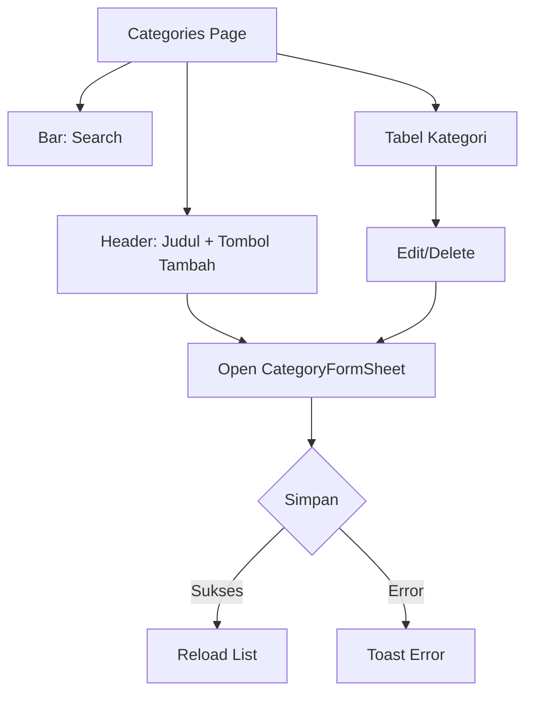
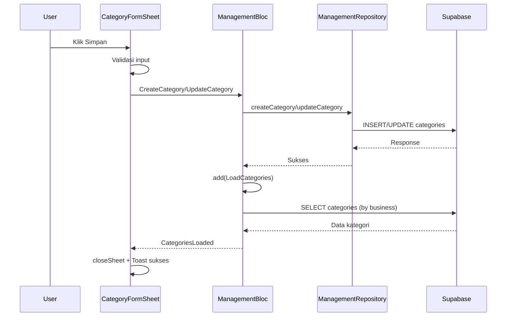
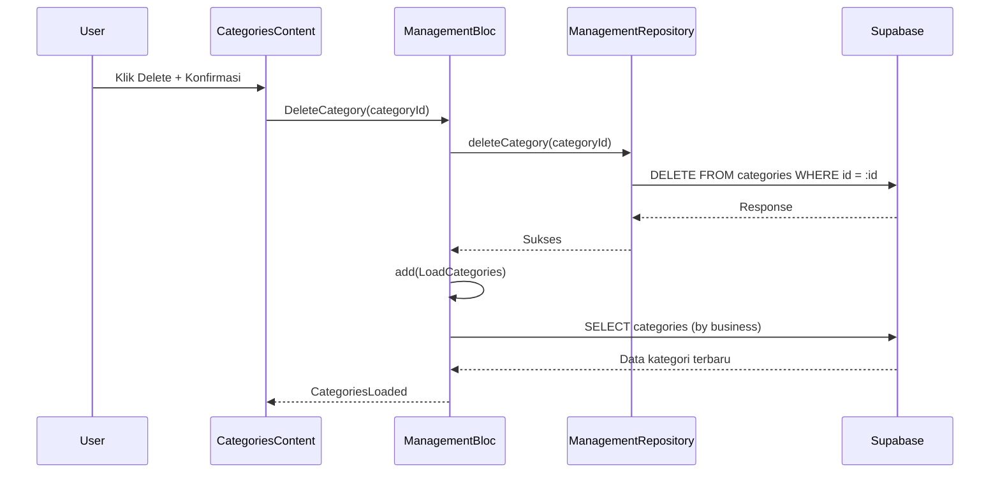
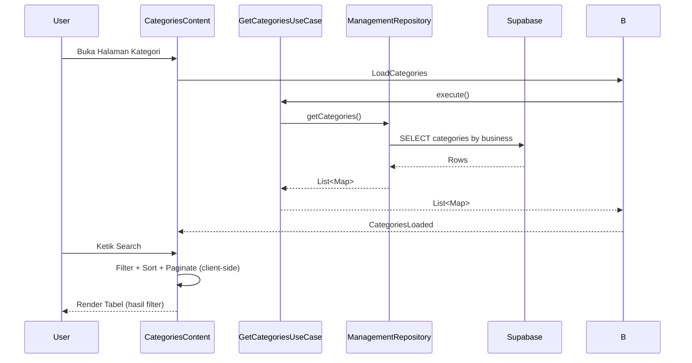

## Manajemen Kategori (Master Data)

### Overview

Dokumen ini menjelaskan modul Manajemen Kategori di Ourbit POS: alur UI, integrasi BLoC, struktur data, pencarian/filter, aksi CRUD, dan debug logging untuk troubleshooting.

### Komponen & Arsitektur

- UI utama: `app/management/categories/categories_content.dart`
- Form: `app/management/categories/widgets/category_form_sheet.dart`
- BLoC: `blocs/management_bloc.dart`, `management_event.dart`, `management_state.dart`
- Repository: `src/data/repositories/management_repository_impl.dart`
- Layanan: `src/core/services/supabase_service.dart`, `src/core/services/local_storage_service.dart`
- Widget Ourbit: `OurbitTable`, `OurbitButton`, `OurbitTextInput`, `OurbitDialog`, `OurbitIconButton`

## UI Flow (Halaman Kategori)



### Detailed Flowchart

```mermaid
flowchart TD
  subgraph List & Search
    L0[Open Kategori Page] --> L1[Dispatch LoadCategories]
    L1 --> L2[ManagementLoading]
    L2 --> L3[CategoriesLoaded]
    L3 --> L4[Tampilkan Tabel]
    L4 -->|Search onChange| L5[Filter client-side nama/desc]
    L5 --> L6[Sort + Paginate]
    L6 --> L4
  end

  subgraph Create/Edit
    C0[Klik Tambah/ Edit] --> C1[Open CategoryFormSheet]
    C1 --> C2[Ketik Nama]
    C2 --> C3{Simpan}
    C3 -->|Create| C4[Dispatch CreateCategory]
    C3 -->|Update| C5[Dispatch UpdateCategory]
    C4 --> C6[Dispatch LoadCategories]
    C5 --> C6
    C6 --> C7[CategoriesLoaded]
    C7 --> C8[Tutup Sheet + Toast Sukses]
  end

  subgraph Delete
    D0[Klik Delete] --> D1[Dialog Konfirmasi]
    D1 -->|Hapus| D2[Dispatch DeleteCategory]
    D1 -->|Batal| D3[Close Dialog]
    D2 --> D4[Dispatch LoadCategories]
    D4 --> D5[CategoriesLoaded]
  end
```



## Detail Layout

- **Header**: judul "Kategori" dan deskripsi; tombol "Tambah Kategori" membuka sheet kanan.
- **Search**: `OurbitTextInput` untuk mencari nama/deskipsi (client-side).
- **Tabel**: `OurbitTable` full width, kolom:
  - Kategori (360px): ikon + nama + deskripsi (ellipsis 1 baris)
  - Jumlah Produk (160px)
  - Dibuat (160px)
  - Aksi (96px): Edit/Delete
- **Pagination**: baris per halaman (10/20/50) + tombol Prev/Next.
- **Sorting internal**: name/product_count/created_at (pola disiapkan untuk header interaktif bila diperlukan).
- **Dark Mode**: border kontainer tabel mengikuti `appbar.dart` (terang: `#E5E7EB`, gelap: `#292524`).
- **Caching**: `_cachedCategories` mencegah list hilang saat state BLoC berganti (mis. sheet dibuka).

## Form Kategori (CategoryFormSheet)

### Susunan Field

1. Nama Kategori
2. Tombol: Batal, Simpan

### Perilaku

- Validasi minimal: nama wajib diisi.
- Saat sukses: sheet ditutup lebih dahulu, lalu tampil toast sukses di bagian atas.

### Penyimpanan (Submit)

- Mengirim event ke BLoC:
  - Create: `CreateCategory(categoryData)`
  - Update: `UpdateCategory(categoryId, categoryData)`
- Setelah sukses: `LoadCategories()`, menutup sheet, menampilkan toast sukses.

## BLoC Integrasi

### Events penting

- `LoadCategories`
- `CreateCategory(categoryData)`, `UpdateCategory(categoryId, categoryData)`, `DeleteCategory(categoryId)`

### States

- `ManagementLoading`, `ManagementError`
- `CategoriesLoaded(List<Map<String, dynamic>>)`

### Sequence (Create/Update)



### Sequence (Delete)



### Sequence (List + Search)



## Skema Data Kategori (Ringkas)

Tabel `public.categories` (lihat `database/schema.sql`):

- id (uuid, PK)
- business_id (uuid, NOT NULL)
- name (text, NOT NULL)
- created_at/updated_at/by, deleted_at/by

Catatan: jumlah produk per kategori diturunkan dari tabel `products` (contoh implementasi menggunakan relasi `products(count)` dan dihitung di layer repository).

## Pencarian

- Search teks (nama/deskripsi) real-time, reset halaman ke 1.
- Pencarian dilakukan sebelum sorting dan pagination.

## Dark Mode

- Border panel tabel mengikuti warna `appbar.dart`:
  - Light: `#E5E7EB`
  - Dark: `#292524`

## Debug Logging

Menggunakan `Logger` (`src/core/utils/logger.dart`).

### BLoC

```
BLOC: CreateCategory payload=...
BLOC: CreateCategory success / error <detail>
BLOC: UpdateCategory id=... success / error <detail>
BLOC: DeleteCategory id=... success / error <detail>
BLOC: LoadCategories start / success count=N / error <detail>
```

### Repository

```
REPO: getCategories response count=N
REPO: createCategory payload=...
REPO: updateCategory id=... payload=...
REPO: deleteCategory id=...
REPO: error=...
```

## Error Umum & Solusi

- Tidak tersimpan (RLS/Policy)
  - Solusi: pastikan kebijakan RLS tabel `categories` mengizinkan INSERT/UPDATE/DELETE untuk user/business terkait, atau nonaktifkan RLS sementara saat pengembangan.
- Hapus tertolak karena kategori masih memiliki produk
  - Solusi: tampilkan pesan dan blokir hapus jika `product_count > 0` (sudah diimplementasikan di UI).

## Testing Scenarios

- Tambah kategori baru dan pastikan tampil di list.
- Edit nama kategori dan simpan perubahan.
- Hapus kategori kosong (tanpa produk) dengan konfirmasi.
- Coba hapus kategori yang memiliki produk → harus tertolak dengan pesan.
- Search bekerja real-time dan sinkron dengan pagination.
- Toast sukses/error muncul di atas; sheet tertutup setelah simpan.

## Catatan Implementasi

- Sorting header dapat diaktifkan kemudian (klik kolom mengubah `_sortKey/_sortAsc`).
- Cache `_cachedCategories` untuk mencegah flicker saat state berubah.
- Business ID diambil dari local storage (lihat `LocalStorageService`); repository memastikan filter berdasarkan bisnis/tenant yang aktif.
