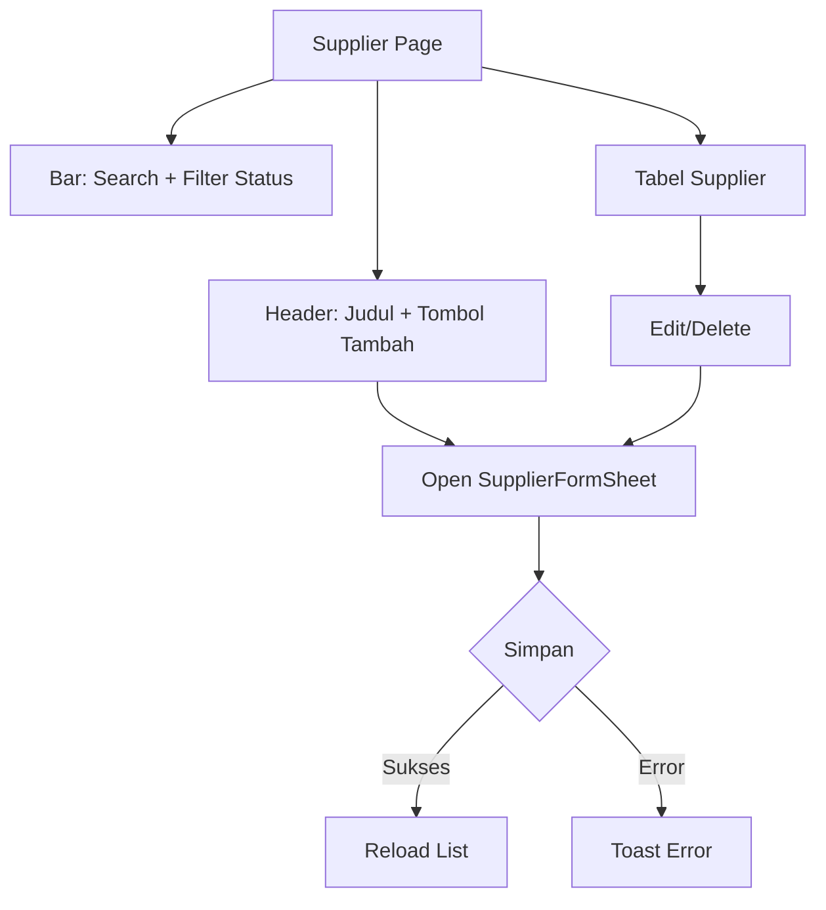
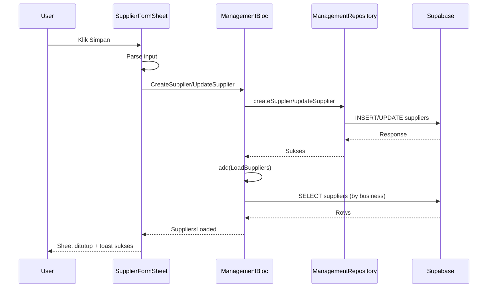
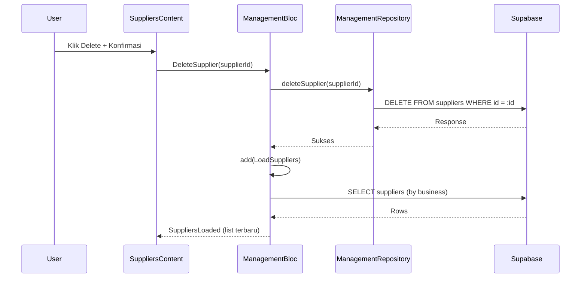
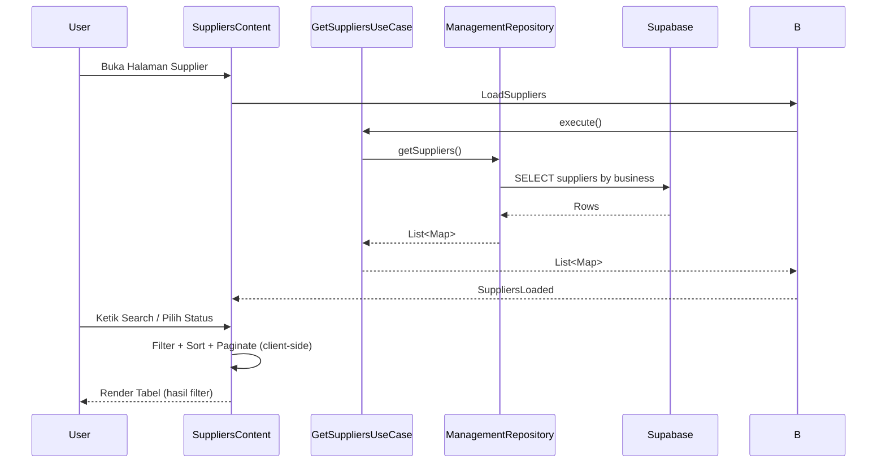

## Manajemen Supplier (Master Data)

### Overview

Dokumen ini menjelaskan modul Manajemen Supplier di Ourbit POS, meliputi alur UI, integrasi BLoC, skema data, penyimpanan ke Supabase (insert/update/delete), filter & pencarian, serta debug logging untuk memudahkan troubleshooting.

### Komponen & Arsitektur

- **UI utama**: `app/management/suppliers/suppliers_content.dart`
- **Form**: `app/management/suppliers/widgets/supplier_form_sheet.dart`
- **BLoC**: `blocs/management_bloc.dart`, `management_event.dart`, `management_state.dart`
- **Repository**: `src/data/repositories/management_repository_impl.dart`
- **Usecase**: `src/data/usecases/get_suppliers_usecase.dart`
- **Layanan**: `src/core/services/supabase_service.dart`, `src/core/services/local_storage_service.dart`
- **Widget Ourbit**: `OurbitTable`, `OurbitButton`, `OurbitTextInput`, `OurbitSelect`, `OurbitDialog`, `OurbitIconButton`, `OurbitTextArea`, `OurbitSwitch`

## UI Flow (Halaman Supplier)



### Detailed Flowchart

```mermaid
flowchart TD
  subgraph List & Filter
    L0[Open Supplier Page] --> L1[Dispatch LoadSuppliers]
    L1 --> L2[ManagementLoading]
    L2 --> L3[SuppliersLoaded]
    L3 --> L4[Tampilkan Tabel]
    L4 -->|Search onChange| L5[Filter client-side nama/kode/kontak/email]
    L4 -->|Pilih Status| L6[Filter client-side aktif/nonaktif]
    L5 --> L7[Sort + Paginate]
    L6 --> L7
    L7 --> L4
  end

  subgraph Create/Edit
    C0[Klik Tambah/ Edit] --> C1[Open SupplierFormSheet]
    C1 --> C2[Kumpulkan Payload]
    C2 --> C3{Create / Update}
    C3 -->|Create| C4[Dispatch CreateSupplier]
    C3 -->|Update| C5[Dispatch UpdateSupplier]
    C4 --> C6[Dispatch LoadSuppliers]
    C5 --> C6
    C6 --> C7[SuppliersLoaded]
    C7 --> C8[Tutup Sheet + Toast Sukses]
  end

  subgraph Delete
    D0[Klik Delete] --> D1[Dialog Konfirmasi]
    D1 -->|Hapus| D2[Dispatch DeleteSupplier]
    D1 -->|Batal| D3[Close Dialog]
    D2 --> D4[Dispatch LoadSuppliers]
    D4 --> D5[SuppliersLoaded]
  end
```



## Detail Layout

- **Header**: judul "Supplier" dan deskripsi; tombol "Tambah Supplier" membuka sheet di sisi kanan.
- **Search**: `OurbitTextInput` untuk cari nama/kode/kontak/email.
- **Filter Status**: `OurbitSelect<String>` dengan opsi "Semua Status", "Aktif", "Nonaktif".
- **Tabel**: `OurbitTable` full width, kolom:
  - Supplier (320px): avatar ikon + nama + contact person (ellipsis 1 baris)
  - Kontak (240px): email dan telepon
  - Limit Kredit (160px, right)
  - Term Pembayaran (160px)
  - Status (120px): chip Aktif/Nonaktif
  - Tanggal Dibuat (180px)
  - Aksi (96px): Edit/Delete
- **Pagination**: pemilihan baris per halaman (10/20/50) + tombol Prev/Next.
- **Sorting internal**: minimal berdasarkan nama (naik), bisa ditambah sesuai kebutuhan.
- **Dark Mode**: border kontainer tabel mengikuti `appbar.dart` (terang: `#E5E7EB`, gelap: `#292524`).
- **Caching**: `_cachedSuppliers` mencegah list hilang saat state BLoC berganti (mis. sheet dibuka).

## Form Supplier (SupplierFormSheet)

### Susunan Field

1. Nama Supplier (wajib)
2. Kode Supplier
3. Contact Person
4. Email
5. Nomor Telepon
6. Alamat
7. Kota (ID) & Provinsi (ID) & Negara (ID)
8. NPWP
9. Nama Bank, Nomor Rekening, Nama Pemilik Rekening
10. Limit Kredit, Term Pembayaran (hari)
11. Status Aktif
12. Catatan
13. Tombol: Batal, Simpan

### Parsing & Validasi Input

- `credit_limit`: dikonversi ke double.
- `payment_terms`: dikonversi ke integer.
- `name`: wajib; email opsional dengan pola sederhana.

### Penyimpanan (Submit)

- Mengirim event ke BLoC:
  - Create: `CreateSupplier(supplierData)`
  - Update: `UpdateSupplier(supplierId, supplierData)`
- Setelah sukses: `LoadSuppliers()`, menutup sheet, menampilkan toast sukses.

## BLoC Integrasi

### Events penting

- `LoadSuppliers`
- `CreateSupplier(supplierData)`, `UpdateSupplier(supplierId, supplierData)`, `DeleteSupplier(supplierId)`

### States

- `ManagementLoading`, `ManagementError`
- `SuppliersLoaded(List<Map<String, dynamic>>)`

### Sequence (Create/Update)



### Sequence (Delete)



### Sequence (List + Search + Filter)



## Skema Data Supplier (Ringkas)

Tabel `public.suppliers` (lihat `database/schema.sql`):

- id (uuid, PK)
- business_id (uuid, NOT NULL)
- name (text, NOT NULL)
- code (varchar)
- contact_person (varchar)
- email (varchar)
- phone (varchar)
- address (text)
- city_id (varchar)
- province_id (varchar)
- country_id (varchar)
- tax_number (varchar)
- bank_name (varchar)
- bank_account_number (varchar)
- bank_account_name (varchar)
- credit_limit (numeric, default 0)
- payment_terms (integer, default 0)
- is_active (boolean, default true)
- notes (text)
- created_at/updated_at/by, deleted_at/by

Repository menambahkan filter `business_id` saat SELECT/INSERT/UPDATE/DELETE.

## Filter & Pencarian

- Search teks (nama/kode/kontak/email) real-time, reset halaman ke 1.
- Filter status via `OurbitSelect` dengan opsi "all"/"active"/"inactive" → memfilter sebelum sorting & pagination.

## Dark Mode

- Border panel menu dan tabel mengikuti warna `appbar.dart`:
  - Light: `#E5E7EB`
  - Dark: `#292524`

## Dependencies

- Menggunakan komponen Ourbit dan `shadcn_flutter` (sudah ada di proyek). Tidak ada dependency ekstra khusus supplier.

## Debug Logging

Menggunakan `Logger` (`src/core/utils/logger.dart`) untuk BLoC/Repository:

```
BLOC: CreateSupplier payload=...
BLOC: CreateSupplier success / error <detail>
BLOC: UpdateSupplier id=... success / error <detail>
BLOC: DeleteSupplier id=... success / error <detail>
BLOC: LoadSuppliers start / success count=N / error <detail>

REPO: getSuppliers business_id=...
REPO: createSupplier payload=...
REPO: updateSupplier id=... payload=...
REPO: deleteSupplier id=...
```

## Error Umum & Solusi

- PostgrestException invalid input syntax for type integer: "30.0"

  - **Penyebab**: field integer (payment_terms) diberi nilai desimal.
  - **Solusi**: parsing telah dibetulkan (dibulatkan ke int). Pastikan input bersih.

- Nilai limit kredit tidak terformat

  - **Solusi**: gunakan formatter tampilan; parsing payload sudah double.

- Tidak tersimpan (RLS/Policy)
  - **Solusi**: pastikan kebijakan RLS tabel `suppliers` mengizinkan INSERT/UPDATE/DELETE untuk `business_id` terkait, atau nonaktifkan RLS sementara saat pengembangan.

## Testing Scenarios

- Tambah supplier baru (nama wajib) dengan data kontak lengkap/parsial.
- Validasi format email sederhana.
- Edit supplier mengisi field dengan benar; simpan perubahan.
- Hapus supplier dengan konfirmasi.
- Filter status dan pencarian bekerja bersama pagination.
- Cek log alur end-to-end (form → BLoC → Repo → Supabase → reload list).

## Catatan Implementasi

- Kolom dapat diperluas (mis. alamat di kolom Kontak) bila dibutuhkan.
- Sorting header bisa diaktifkan kemudian (klik kolom mengubah kunci sort/arah).
- Pastikan `business_id` tersedia di local storage; repository telah memasukkan `business_id` pada operasi INSERT.
