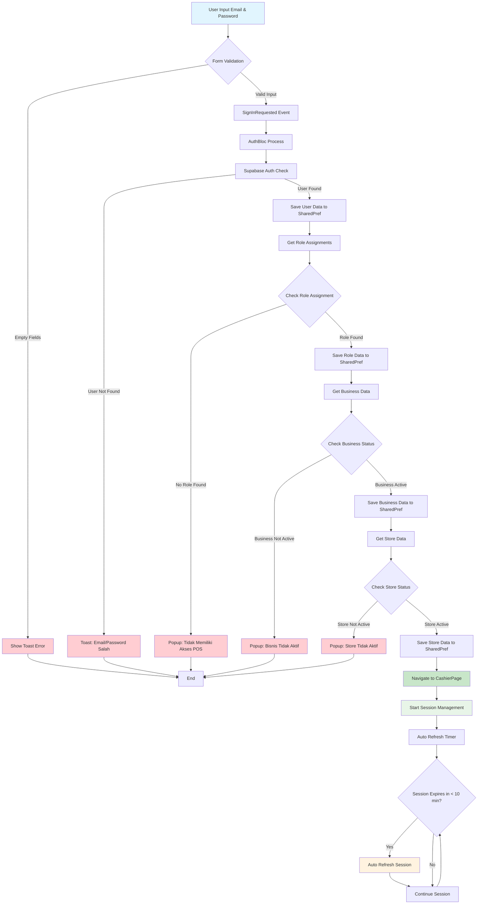
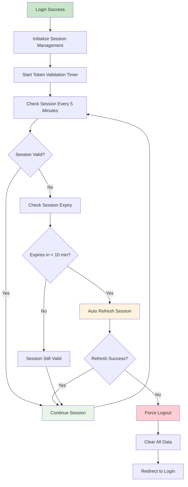
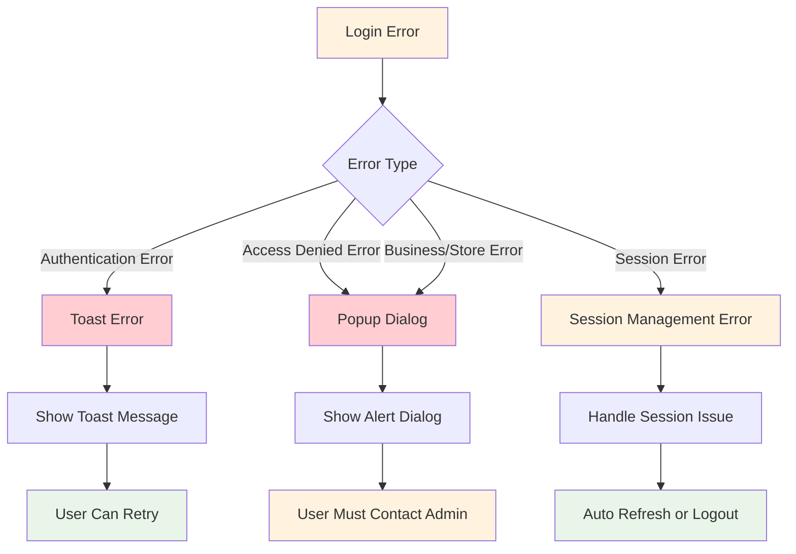
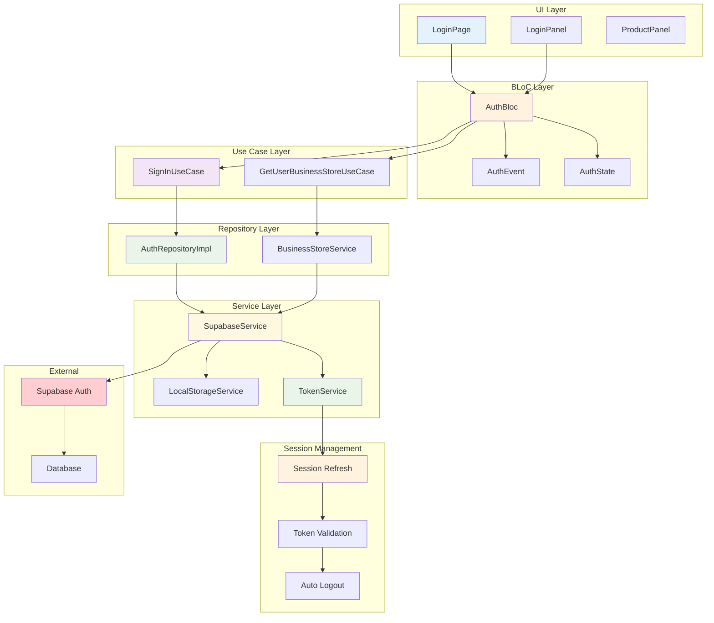
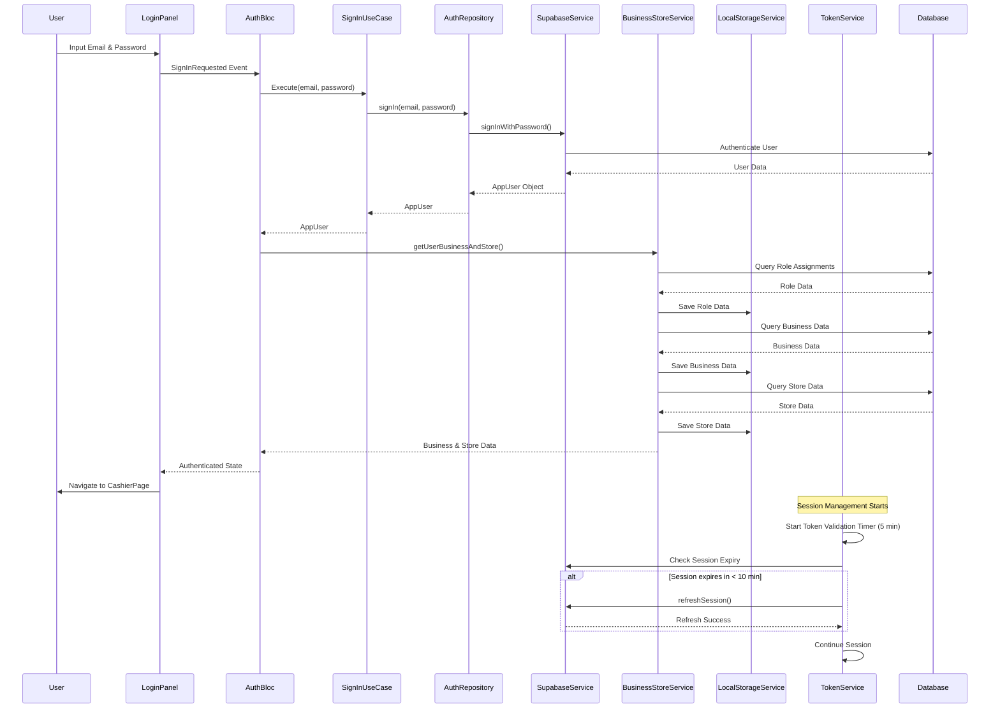
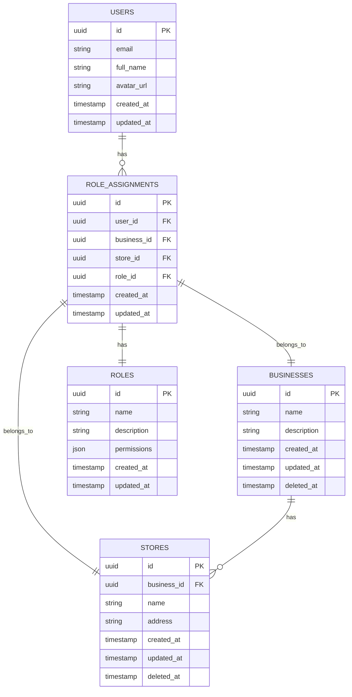
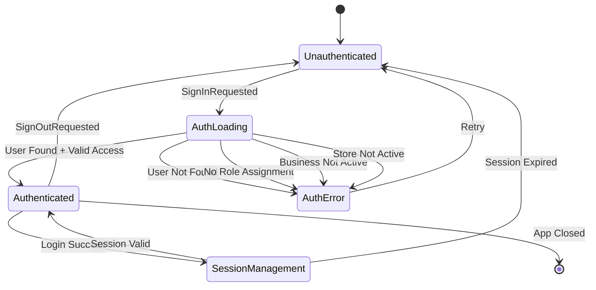

# Flow Login Ourbit Kasir

## Overview

Dokumen ini menjelaskan alur login aplikasi Ourbit Kasir yang mengikuti validasi bertingkat untuk memastikan user memiliki akses yang tepat ke sistem. Sistem telah diperbaiki untuk mengatasi masalah logout otomatis dengan menambahkan refresh session otomatis dan validasi yang lebih akurat.

## Flow Diagram

```
User Login → Validasi User → Cek Role → Validasi Bisnis → Validasi Store → Route ke POS
     ↓              ↓           ↓           ↓              ↓
   Email/      User tidak   Tidak ada   Bisnis tidak   Store tidak
  Password     ditemukan    role        aktif          aktif
     ↓              ↓           ↓           ↓              ↓
   Toast        Popup        Popup       Popup         Popup
   Error        Error        Error       Error         Error
```

## Detailed Flowchart



## Session Management Flow



## Error Flow Diagram



## Data Flow Diagram

```mermaid
flowchart LR
    A[User Input] --> B[Auth Repository]
    B --> C[Supabase Auth]
    C --> D[User Data]
    D --> E[SharedPreferences]

    E --> F[Business Store Service]
    F --> G[Role Assignments Query]
    G --> H[Business Data]
    H --> I[Store Data]

    I --> J[Local Storage]
    J --> K[Cashier Page]
    K --> L[Session Management]

    L --> M[Token Validation Timer]
    M --> N[Auto Refresh Check]
    N --> O[Session Refresh]
    O --> P[Continue Session]

    style A fill:#e3f2fd
    style E fill:#f3e5f5
    style J fill:#e8f5e8
    style K fill:#c8e6c9
    style L fill:#fff3e0
    style O fill:#e8f5e8
```



## Component Architecture Diagram



## Updated Implementation Details

### AuthBloc Integration

```dart
class AuthBloc extends Bloc<AuthEvent, AuthState> {
  // After successful login, automatically load business/store data
  Future<void> _onSignInRequested(SignInRequested event, Emitter<AuthState> emit) async {
    emit(const AuthLoading(isCheckingAuth: false));
    try {
      final user = await _signInUseCase(event.email, event.password);
      if (user != null) {
        // Get business and store data after successful login
        await _getUserBusinessStoreUseCase.execute();
        emit(Authenticated(user));
      } else {
        emit(const AuthError('Email atau password salah'));
      }
    } catch (e) {
      emit(AuthError(e.toString()));
    }
  }
}
```

### BusinessStoreService Integration

```dart
class BusinessStoreService {
  Future<Map<String, dynamic>> getUserBusinessAndStore() async {
    // Get user's role assignments with business, store, and role data
    final roleAssignmentsResponse = await _supabaseClient
        .from('role_assignments')
        .select('*, businesses(*), stores(*), roles(*)')
        .eq('user_id', user.id);

    // Validate business and store status
    if (businessResponse['deleted_at'] != null) {
      throw Exception('Bisnis tidak aktif atau tidak ditemukan');
    }

    if (storeResponse['deleted_at'] != null) {
      throw Exception('Store tidak aktif atau tidak ditemukan');
    }

    // Save all data to local storage
    await LocalStorageService.saveUserData(userData);
    await LocalStorageService.saveBusinessData(businessResponse);
    await LocalStorageService.saveStoreData(storeResponse);
    await LocalStorageService.saveRoleAssignmentData(completeRoleAssignment);
  }
}
```

## Sequence Diagram



## Database Schema Diagram



## State Transition Diagram



## Detail Flow

### 1. User Login dengan Email dan Password

- **Input**: User memasukkan email dan password
- **Validasi**: Form validation untuk memastikan field tidak kosong
- **Action**: Trigger `SignInRequested` event ke AuthBloc

### 2. Validasi User

- **Proses**: Cek user di database Supabase
- **Success**: User ditemukan, ambil dan simpan data profile di SharedPreferences
- **Error**: User tidak ditemukan
- **Response**: Toast error "Email atau password salah"

### 3. Cek Role Assignments

- **Proses**: Ambil data `role_assignments` dengan join ke business, store, dan role
- **Query**:
  ```sql
  SELECT *, businesses(*), stores(*), roles(*)
  FROM role_assignments
  WHERE user_id = ?
  ```
- **Success**: Role ditemukan, simpan data role di SharedPreferences
- **Error**: Tidak ada role assignment
- **Response**: Popup error "Kamu tidak memiliki akses ke aplikasi POS"

### 4. Validasi Bisnis

- **Proses**: Cek status bisnis (tidak dihapus)
- **Validasi**:
  - Bisnis harus ada (tidak null)
  - `deleted_at` harus null
- **Success**: Bisnis aktif, simpan data bisnis di SharedPreferences
- **Error**: Bisnis tidak aktif atau tidak ditemukan
- **Response**: Popup error "Bisnis tidak aktif atau tidak ditemukan"

### 5. Validasi Store

- **Proses**: Cek status store (tidak dihapus)
- **Validasi**:
  - Store harus ada (tidak null)
  - `deleted_at` harus null
- **Success**: Store aktif, simpan data store di SharedPreferences
- **Error**: Store tidak aktif atau tidak ditemukan
- **Response**: Popup error "Store tidak aktif atau tidak ditemukan"

### 6. Route ke CashierPage

- **Proses**: Semua validasi berhasil
- **Action**: Navigate ke `/pos` (CashierPage)
- **Data**: Semua data user, role, bisnis, dan store tersimpan di SharedPreferences

### 7. Session Management (Baru)

- **Timer**: Mulai timer validasi token setiap 5 menit
- **Auto Refresh**: Cek apakah session akan expired dalam 10 menit
- **Refresh**: Jika ya, refresh session otomatis
- **Validation**: Validasi session dengan Supabase
- **Logout**: Jika session invalid, force logout

## Session Management Improvements

### Auto Refresh Mechanism

```dart
// Check if session will expire in the next 10 minutes
if (session.expiresAt != null) {
  final expiryTime = DateTime.fromMillisecondsSinceEpoch(session.expiresAt!);
  final now = DateTime.now();
  final timeUntilExpiry = expiryTime.difference(now);

  // If session expires in less than 10 minutes, try to refresh
  if (timeUntilExpiry.inMinutes < 10) {
    await SupabaseService.client.auth.refreshSession();
    return true;
  }
}
```

### Improved Token Validation

```dart
static Future<bool> isTokenValid() async {
  try {
    // First check if Supabase session is still valid
    final user = SupabaseService.client.auth.currentUser;
    if (user == null) {
      await clearToken();
      return false;
    }

    // Check if session is still valid
    final session = SupabaseService.client.auth.currentSession;
    if (session == null) {
      await clearToken();
      return false;
    }

    // Check if session is expired
    if (session.expiresAt != null &&
        DateTime.fromMillisecondsSinceEpoch(session.expiresAt!).isBefore(DateTime.now())) {
      await clearToken();
      return false;
    }

    return true;
  } catch (e) {
    await clearToken();
    return false;
  }
}
```

## Error Handling

### Toast Error (untuk error umum)

- Email/password salah
- Network error
- Server error

### Popup Error (untuk error akses)

- User tidak memiliki akses ke aplikasi POS
- Bisnis tidak aktif atau tidak ditemukan
- Store tidak aktif atau tidak ditemukan

### Session Error (baru)

- Session expired
- Refresh session failed
- Network connectivity issues

## Data yang Disimpan di SharedPreferences

### 1. User Data

```json
{
	"id": "user_id",
	"email": "user@example.com",
	"name": "User Name",
	"avatar": "avatar_url"
}
```

### 2. Role Assignment Data

```json
{
	"id": "role_assignment_id",
	"user_id": "user_id",
	"business_id": "business_id",
	"store_id": "store_id",
	"role_id": "role_id",
	"businesses": {
		"id": "business_id",
		"name": "Business Name",
		"created_at": "timestamp",
		"deleted_at": null
	},
	"stores": {
		"id": "store_id",
		"name": "Store Name",
		"business_id": "business_id",
		"created_at": "timestamp",
		"deleted_at": null
	},
	"roles": {
		"id": "role_id",
		"name": "Role Name",
		"description": "Role Description",
		"permissions": {},
		"created_at": "timestamp"
	}
}
```

### 3. Business Data

```json
{
	"id": "business_id",
	"name": "Business Name",
	"created_at": "timestamp",
	"deleted_at": null
}
```

### 4. Store Data

```json
{
	"id": "store_id",
	"name": "Store Name",
	"business_id": "business_id",
	"created_at": "timestamp",
	"deleted_at": null
}
```

## Komponen yang Terlibat

### 1. UI Layer

- `LoginPage`: Halaman utama login
- `LoginPanel`: Form login dengan validasi
- `ProductPanel`: Panel promo produk (desktop only)

### 2. BLoC Layer

- `AuthBloc`: State management untuk authentication
- `AuthEvent`: Events untuk login/logout
- `AuthState`: States untuk UI updates

### 3. Use Case Layer

- `SignInUseCase`: Business logic untuk login
- `GetUserBusinessStoreUseCase`: Business logic untuk ambil data bisnis/store

### 4. Repository Layer

- `AuthRepositoryImpl`: Implementasi repository untuk auth
- `BusinessStoreService`: Service untuk data bisnis/store

### 5. Service Layer

- `SupabaseService`: Service untuk operasi database
- `LocalStorageService`: Service untuk SharedPreferences
- `TokenService`: Service untuk session management (baru)

## Database Schema

### Tables yang Terlibat

1. `auth.users` - User authentication
2. `role_assignments` - User role assignments
3. `businesses` - Business data
4. `stores` - Store data
5. `roles` - Role definitions

### Key Relationships

- `role_assignments.user_id` → `auth.users.id`
- `role_assignments.business_id` → `businesses.id`
- `role_assignments.store_id` → `stores.id`
- `role_assignments.role_id` → `roles.id`
- `stores.business_id` → `businesses.id`

## Security Considerations

### 1. Input Validation

- Email format validation
- Password strength requirements
- SQL injection prevention (via Supabase)

### 2. Error Messages

- Tidak mengekspos informasi sensitif dalam error messages
- Error messages dalam bahasa Indonesia
- Consistent error handling

### 3. Session Management

- Token-based authentication via Supabase
- Automatic token refresh (baru)
- Proactive session management (baru)
- Secure logout dengan clear semua data

## Testing Scenarios

### 1. Happy Path

- User dengan kredensial valid
- Memiliki role assignment
- Bisnis dan store aktif
- Session management berjalan normal
- Expected: Berhasil login dan route ke POS

### 2. Error Scenarios

- User tidak ditemukan
- User tanpa role assignment
- Bisnis tidak aktif
- Store tidak aktif
- Network error
- Server error
- Session expired (baru)
- Refresh session failed (baru)

### 3. Session Management Scenarios (baru)

- Session valid selama penggunaan
- Auto refresh sebelum expired
- Graceful logout saat session invalid
- Network recovery setelah offline

## Maintenance Notes

### 1. Error Message Updates

- Semua error message dalam bahasa Indonesia
- Konsisten dengan UX guidelines
- Mudah dipahami oleh end user

### 2. Performance Optimization

- Caching data di SharedPreferences
- Minimal database calls
- Efficient state management
- Reduced validation frequency (5 min instead of 30 sec)

### 3. Monitoring

- Log semua error untuk debugging
- Track login success/failure rates
- Monitor session refresh success/failure rates
- Monitor performance metrics

## Recent Improvements (v2.0)

### Session Management

1. **Auto Refresh**: Session automatically refreshed before expiry
2. **Improved Validation**: Check Supabase session instead of just stored token
3. **Reduced Frequency**: Validation every 5 minutes instead of 30 seconds
4. **Better Error Handling**: More robust error handling and recovery

### Performance

1. **Fewer API Calls**: Reduced validation frequency
2. **Proactive Refresh**: Prevents unexpected logouts
3. **Better Caching**: Improved local data management
4. **Memory Optimization**: Better timer and resource management

### Security

1. **Session Integrity**: Proper session validation
2. **Secure Refresh**: Safe session refresh mechanism
3. **Data Protection**: Enhanced data clearing on logout
4. **Error Recovery**: Graceful handling of authentication errors
