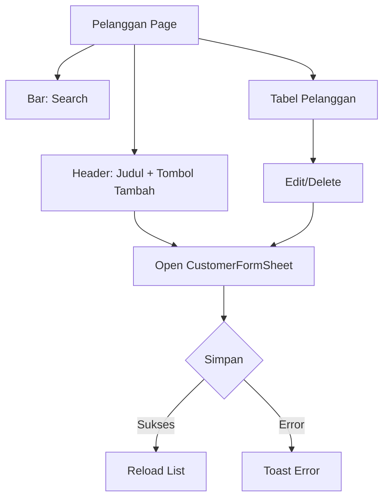
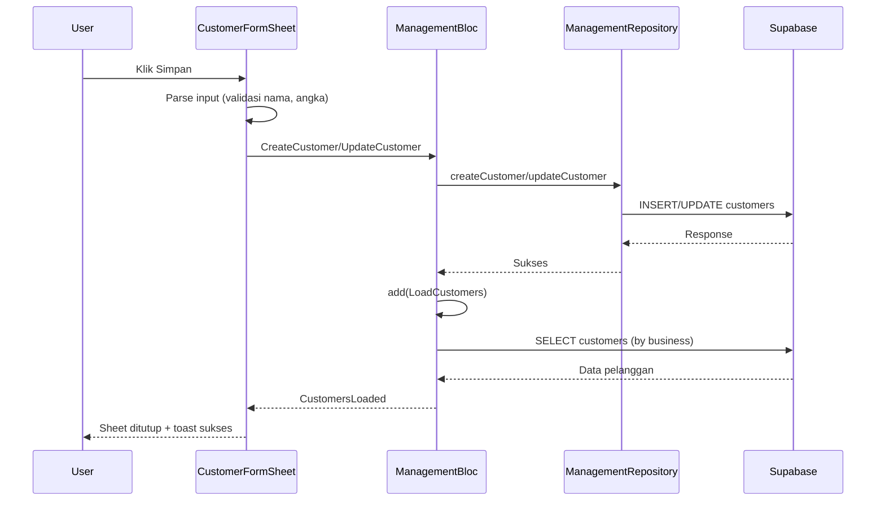
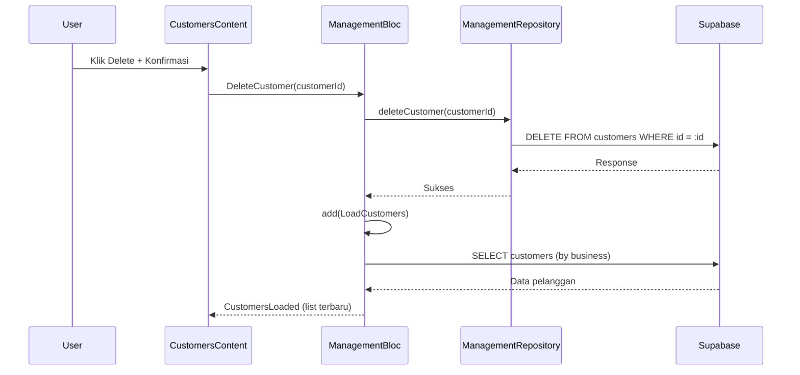
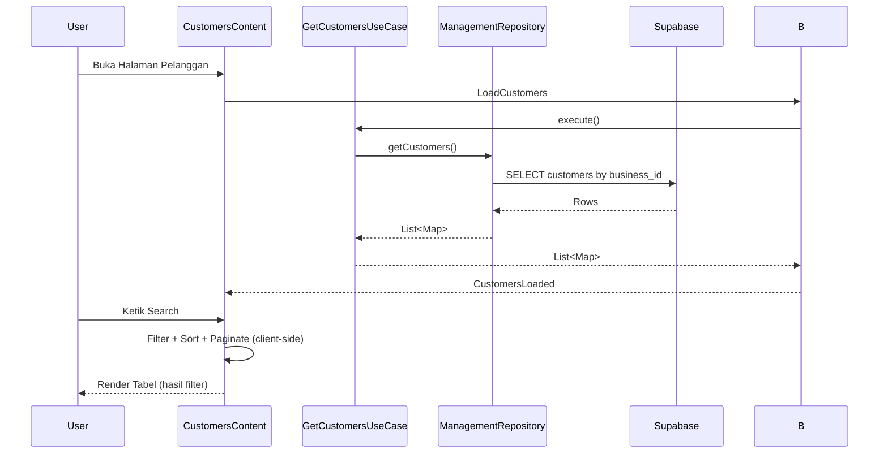
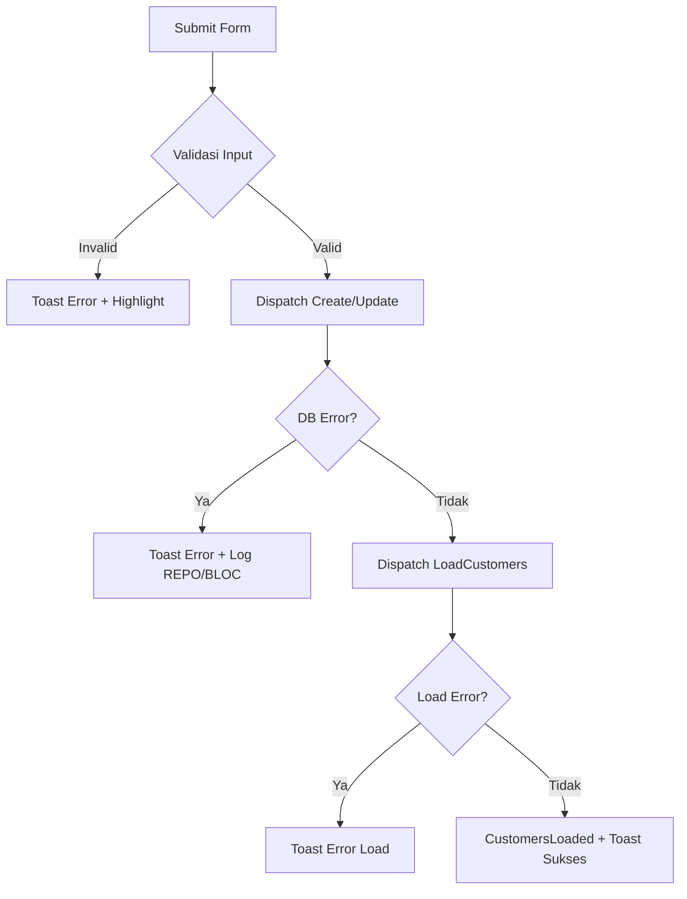

## Manajemen Pelanggan (Master Data)

### Overview

Dokumen ini menjelaskan modul Manajemen Pelanggan di Ourbit POS, meliputi alur UI, integrasi BLoC, skema data, penyimpanan ke Supabase (insert/update/delete), pencarian, serta debug logging untuk memudahkan troubleshooting.

### Komponen & Arsitektur

- UI utama: `app/management/customers/customers_content.dart`
- Form: `app/management/customers/widgets/customer_form_sheet.dart`
- BLoC: `blocs/management_bloc.dart`, `management_event.dart`, `management_state.dart`
- Repository: `src/data/repositories/management_repository_impl.dart`
- Layanan: `src/core/services/supabase_service.dart`, `src/core/services/local_storage_service.dart`
- Widget Ourbit: `OurbitTable`, `OurbitButton`, `OurbitTextInput`, `OurbitDialog`, `OurbitIconButton`, `OurbitTextArea`, `OurbitSelect`

## UI Flow (Halaman Pelanggan)



### Detailed Flowchart

```mermaid
flowchart TD
  subgraph List & Search
    L0[Open Pelanggan Page] --> L1[Dispatch LoadCustomers]
    L1 --> L2[ManagementLoading]
    L2 --> L3[CustomersLoaded]
    L3 --> L4[Tampilkan Tabel]
    L4 -->|Search onChange| L5[Filter client-side nama/email/telepon]
    L5 --> L6[Sort + Paginate]
    L6 --> L4
  end

  subgraph Create/Edit
    C0[Klik Tambah/ Edit] --> C1[Open CustomerFormSheet]
    C1 --> C2[Kumpulkan Payload]
    C2 --> C3{Create / Update}
    C3 -->|Create| C4[Dispatch CreateCustomer]
    C3 -->|Update| C5[Dispatch UpdateCustomer]
    C4 --> C6[Dispatch LoadCustomers]
    C5 --> C6
    C6 --> C7[CustomersLoaded]
    C7 --> C8[Tutup Sheet + Toast Sukses]
  end

  subgraph Delete
    D0[Klik Delete] --> D1[Dialog Konfirmasi]
    D1 -->|Hapus| D2[Dispatch DeleteCustomer]
    D1 -->|Batal| D3[Close Dialog]
    D2 --> D4[Dispatch LoadCustomers]
    D4 --> D5[CustomersLoaded]
  end
```



### Detail Layout

- Header: judul "Pelanggan" dan deskripsi; tombol "Tambah Pelanggan" membuka sheet di sisi kanan.
- Search: `OurbitTextInput` (dengan ikon) untuk cari nama/email/telepon.
- Tabel: `OurbitTable` full width, kolom:
  - Pelanggan (320px): avatar inisial + nama + email (ellipsis 1 baris)
  - Kontak (220px): telepon + email (muted)
  - Tipe (140px): Retail/Grosir/Korporat
  - Limit Kredit (160px, right, format IDR)
  - Term Pembayaran (160px): dalam hari
  - Status (140px): chip Aktif/Nonaktif
  - Aksi (96px): Edit/Delete
- Pagination: pemilihan baris per halaman (10/20/50) + tombol Prev/Next.
- Sorting internal: name/customer_type/credit_limit/payment_terms/status (interaksi header belum diaktifkan).
- Dark Mode: border kontainer tabel mengikuti `appbar.dart` (terang: `#E5E7EB`, gelap: `#292524`).
- Caching: `_cachedCustomers` mencegah list hilang saat state BLoC berganti (mis. sheet dibuka).

## Form Pelanggan (CustomerFormSheet)

### Susunan Field

1. Nama Pelanggan (wajib)
2. Kode Pelanggan
3. Email
4. Telepon
5. Alamat (multi-baris)
6. NPWP
7. Tipe Pelanggan: Retail/Grosir/Korporat
8. Limit Kredit & Term Pembayaran (hari)
9. Status Aktif
10. Catatan (multi-baris)
11. Tombol: Batal, Simpan

### Parsing & Validasi Input

- Wajib: name.
- `credit_limit`: numeric (default 0 bila kosong/invalid).
- `payment_terms`: numeric (default 0 bila kosong/invalid).
- String kosong → simpan sebagai `null` untuk kolom opsional (email/phone/address/tax_number/notes/code).

### Penyimpanan (Submit)

- Mengirim event ke BLoC:
  - Create: `CreateCustomer(customerData)`
  - Update: `UpdateCustomer(customerId, customerData)`
- Setelah sukses: `LoadCustomers()`, menutup sheet, menampilkan toast sukses.

## BLoC Integrasi

### Events penting

- `LoadCustomers`
- `CreateCustomer(customerData)`, `UpdateCustomer(customerId, customerData)`, `DeleteCustomer(customerId)`

### States

- `ManagementLoading`, `ManagementError`
- `CustomersLoaded(List<Map<String, dynamic>>)`

### Sequence (Create/Update)



### Sequence (Delete)



### Sequence (List + Search)



## Skema Data Pelanggan (Ringkas)

Tabel `public.customers` (lihat `database/schema.sql` jika tersedia):

- id (uuid, PK)
- business_id (uuid, NOT NULL)
- name (text, NOT NULL)
- code (varchar, UNIQUE, NULL)
- email (text, NULL)
- phone (text, NULL)
- address (text, NULL)
- city_id (text, NULL)
- province_id (text, NULL)
- country_id (text, NULL)
- tax_number (text, NULL)
- customer_type (text, default 'retail')
- credit_limit (numeric, default 0)
- payment_terms (integer, default 0)
- is_active (boolean, default true)
- notes (text, NULL)
- created_at/updated_at/by, deleted_at/by

## Pencarian

- Search teks (nama/email/telepon) real-time, reset halaman ke 1.
- Dilakukan sebelum sorting & pagination (client-side).

## Dark Mode

- Border panel menu dan tabel mengikuti warna `appbar.dart`:
  - Light: `#E5E7EB`
  - Dark: `#292524`

## Dependencies

- Tidak ada tambahan khusus di `pubspec.yaml` untuk modul ini (memakai widget internal Ourbit + shadcn_flutter).

## Debug Logging

- Menggunakan `Logger` di BLoC untuk operasi Create/Update/Delete Customers.

```
BLOC: CreateCustomer payload=...
BLOC: CreateCustomer success / error <detail>
BLOC: UpdateCustomer id=... success / error <detail>
BLOC: DeleteCustomer id=... success / error <detail>
BLOC: LoadCustomers start / success count=N / error <detail>
```

## Error Flow Diagram



## Testing Scenarios

- Tambah pelanggan baru.
- Edit pelanggan mengisi field dengan benar; simpan perubahan.
- Hapus pelanggan dengan konfirmasi.
- Cek log alur end-to-end (form → BLoC → Repo → Supabase → reload list).
- Pencarian bekerja bersamaan dengan pagination.
- Empty state: ketika belum ada data, tombol "Tambah Pelanggan" tetap muncul dan form dapat dibuka.

## Catatan Implementasi

- Repository `getCustomers()` memfilter berdasarkan `business_id` dari `LocalStorageService`. Pastikan bisnis aktif terset agar data terambil.
- Nilai numeric `credit_limit` dan `payment_terms` diparsing aman (default 0 bila kosong/invalid) untuk menghindari error Postgrest.
- Sorting header bisa diaktifkan kemudian (klik kolom mengubah `_sortKey/_sortAsc`).

