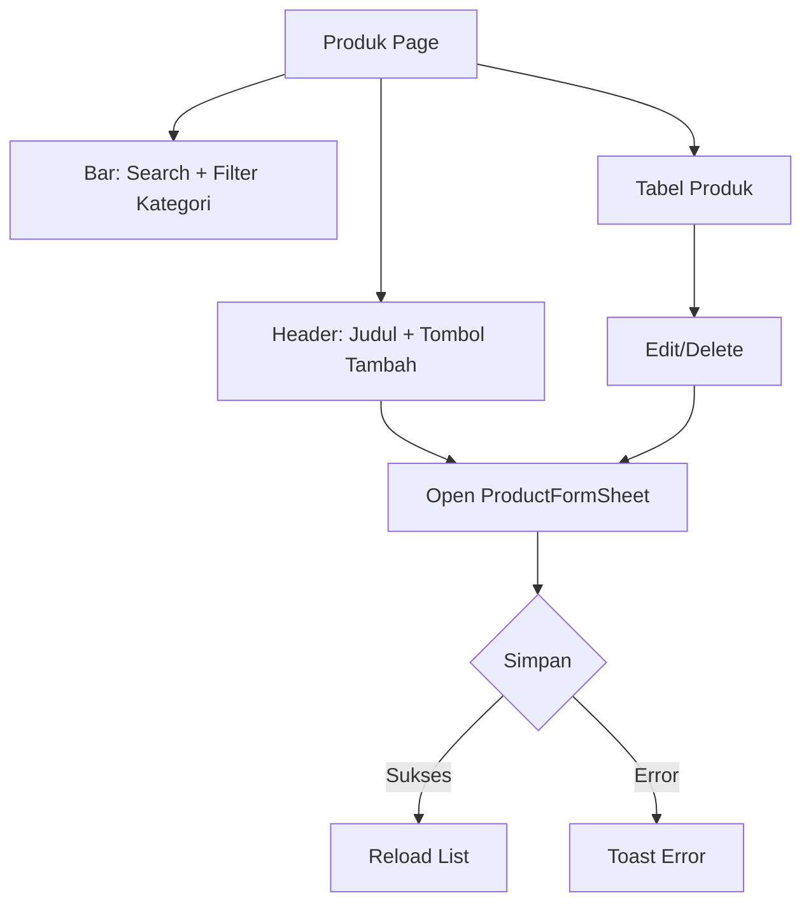
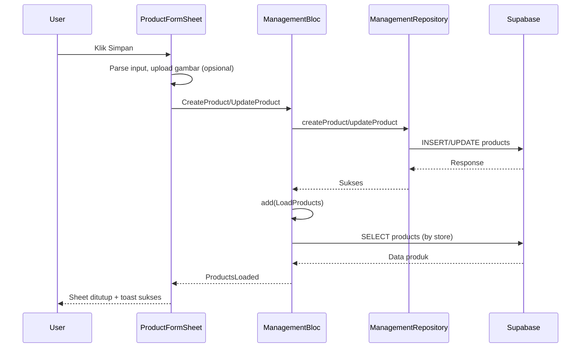
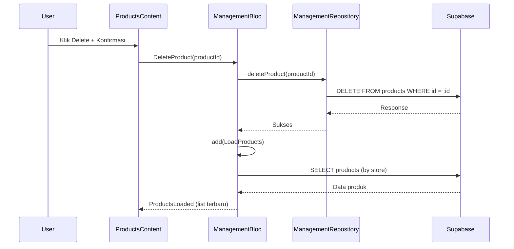
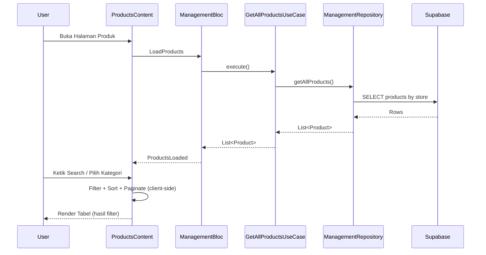
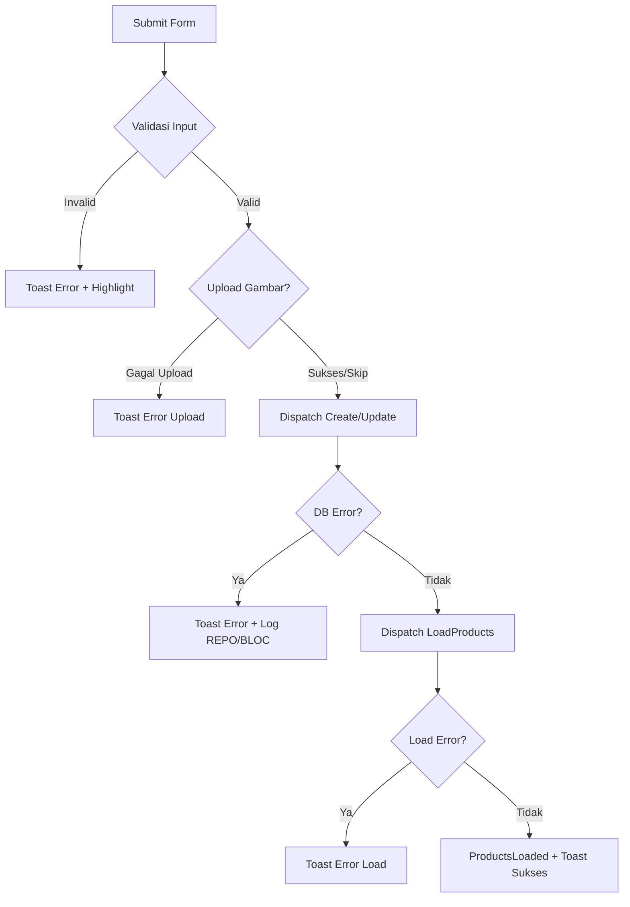

## Manajemen Produk (Master Data)

### Overview

Dokumen ini menjelaskan modul Manajemen Produk di Ourbit POS, meliputi alur UI, integrasi BLoC, skema data, generator SKU, penyimpanan ke Supabase (insert/update/delete), upload gambar, filter & pencarian, serta debug logging untuk memudahkan troubleshooting.

### Komponen & Arsitektur

- UI utama: `app/management/products/products_content.dart`
- Form: `app/management/products/widgets/product_form_sheet.dart`
- BLoC: `blocs/management_bloc.dart`, `management_event.dart`, `management_state.dart`
- Repository: `src/data/repositories/management_repository_impl.dart`
- Model: `src/data/objects/product.dart`
- Layanan: `src/core/services/supabase_service.dart`, `src/core/services/local_storage_service.dart`
- Widget Ourbit: `OurbitTable`, `OurbitButton`, `OurbitTextInput`, `OurbitSelect`, `OurbitDialog`, `OurbitIconButton`, `OurbitTextArea`, `OurbitSKUGenerator`

## UI Flow (Halaman Produk)



### Detailed Flowchart

```mermaid
flowchart TD
  subgraph List & Filter
    L0[Open Produk Page] --> L1[Dispatch LoadProducts]
    L1 --> L2[ManagementLoading]
    L2 --> L3[ProductsLoaded]
    L3 --> L4[Tampilkan Tabel]
    L4 -->|Search onChange| L5[Filter client-side nama/kode/deskripsi]
    L4 -->|Pilih Kategori| L6[Filter client-side kategori]
    L5 --> L7[Sort + Paginate]
    L6 --> L7
    L7 --> L4
  end

  subgraph Create/Edit
    C0[Klik Tambah/ Edit] --> C1[Open ProductFormSheet]
    C1 --> C2{Upload Gambar?}
    C2 -->|Ya| C3[Upload ke Storage]
    C3 --> C4[Ambil publicUrl]
    C2 -->|Tidak| C5[Skip Upload]
    C4 --> C6[Kumpulkan Payload]
    C5 --> C6
    C6 --> C7{Create / Update}
    C7 -->|Create| C8[Dispatch CreateProduct]
    C7 -->|Update| C9[Dispatch UpdateProduct]
    C8 --> C10[Dispatch LoadProducts]
    C9 --> C10
    C10 --> C11[ProductsLoaded]
    C11 --> C12[Tutup Sheet + Toast Sukses]
  end

  subgraph Delete
    D0[Klik Delete] --> D1[Dialog Konfirmasi]
    D1 -->|Hapus| D2[Dispatch DeleteProduct]
    D1 -->|Batal| D3[Close Dialog]
    D2 --> D4[Dispatch LoadProducts]
    D4 --> D5[ProductsLoaded]
  end
```



### Detail Layout

- **Header**: judul "Produk" dan deskripsi; tombol "Tambah Produk" membuka sheet di sisi kanan.
- **Search**: `OurbitTextInput` (tanpa ikon) untuk cari nama/kode/deskripsi.
- **Filter Kategori**: `OurbitSelect<String>` dengan opsi "Semua Kategori", "Tanpa Kategori", dan daftar kategori dari BLoC.
- **Tabel**: `OurbitTable` full width, kolom:
  - Produk (320px): gambar + nama + kode (ellipsis 1 baris)
  - Kategori (160px)
  - Stok (140px): tampilkan stok dan Min:xx
  - Harga Jual (140px, right)
  - Harga Beli (140px, right)
  - Status (180px): chip Aktif/Nonaktif dan status stok (Habis/Menipis/Normal)
  - Aksi (96px): Edit/Delete
- **Pagination**: pemilihan baris per halaman (10/20/50) + tombol Prev/Next.
- **Sorting internal**: name/category/stock/selling/purchase/status (interaksi header belum diaktifkan).
- **Dark Mode**: border kontainer tabel mengikuti `appbar.dart` (terang: `#E5E7EB`, gelap: `#292524`).
- **Caching**: `_cachedProducts` mencegah list hilang saat state BLoC berganti (mis. sheet dibuka).

## Form Produk (ProductFormSheet)

### Susunan Field (mirip web)

1. Gambar Produk (preview + pilih file)
2. Nama Produk
3. Kategori & Jenis Produk (2 kolom)
4. SKU Generator (lihat bagian khusus di bawah)
5. Harga Jual & Harga Beli (2 kolom)
6. Stok & Minimum Stok (2 kolom)
7. Satuan & Berat (gram) (2 kolom)
8. Letak Rak
9. Deskripsi (teks multi-baris)
10. Status Aktif
11. Tombol: Batal, Simpan

### Pemilihan Gambar

- Desktop (macOS/Windows/Linux): `file_picker`
- Mobile/Web: `image_picker`
- Preview menggunakan `Image.file` (BoxFit.cover), tombol "Pilih Gambar/Ganti" di sisi kanan bawah area gambar.

### Parsing & Validasi Input

- **selling_price, purchase_price**: dikonversi ke double.
- **stock, min_stock, weight_grams**: dikonversi ke integer (mendukung input "1000.0" → 1000 melalui round).
- **Wajib**: name, code. SKU validator tersedia di `OurbitSKUGenerator`.

### Penyimpanan (Submit)

- Jika ada gambar: upload ke Supabase Storage bucket `merchants-products` ke path `users/uploads/products/<timestamp>.<ext>`; ambil `publicUrl` dan simpan di `image_url`.
- Mengirim event ke BLoC:
  - Create: `CreateProduct(productData)`
  - Update: `UpdateProduct(productId, productData)`
- Setelah sukses: `LoadProducts()`, menutup sheet, menampilkan toast sukses.

## SKU Generator

### Fitur

- Field SKU + toggle "Auto SKU"
- Pemilihan pola menggunakan `OurbitRadioCard` (horizontal, scrollable):
  - Kategori + Sequential → `ELEC-001`
  - Berdasarkan Nama → `SU-001` (inisial nama + nomor urut)
  - Tanggal + Sequential → `YYMMDD-001`
  - Kustom → `PREFIX-CAT-001[-SUFFIX]`
- Tombol Refresh untuk regenerasi.
- Validasi SKU (min 3 karakter, huruf/angka/dash/underscore, unik – validasi unik bisa ditambahkan ke backend bila dibutuhkan).
- Regenerate ketika: Auto aktif dan nama/kategori/pola berubah, atau tombol Refresh ditekan. Untuk pola "Berdasarkan Nama", nama minimal 3 karakter.

### Contoh

- Nama: "Susu Ultra 1L", Kategori: "Minuman" → Pola Nama: `SU-001`
- Pola Tanggal, 1 Jan 2024 → `240101-001`
- Kustom (Prefix=PROD, Suffix=2024, Kategori=Elektronik) → `PROD-ELE-001-2024`

## BLoC Integrasi

### Events penting

- `LoadProducts`, `LoadCategories`
- `CreateProduct(productData)`, `UpdateProduct(productId, productData)`, `DeleteProduct(productId)`

### States

- `ManagementLoading`, `ManagementError`
- `ProductsLoaded(List<Product>)`, `CategoriesLoaded(List<Map<String, dynamic>>)`

### Sequence (Create/Update)



### Sequence (Delete)



### Sequence (List + Search + Filter)



## Skema Data Produk (Ringkas)

Tabel `public.products` (lihat `database/schema.sql`):

- id (uuid, PK)
- store_id (uuid, NOT NULL)
- category_id (uuid, NULL)
- name (text, NOT NULL)
- code (varchar, UNIQUE)
- type (text, NOT NULL)
- auto_sku (boolean, default true)
- purchase_price (numeric, default 0)
- selling_price (numeric, default 0)
- stock (integer, default 0)
- min_stock (integer, default 0)
- unit (varchar)
- weight_grams (integer, default 0)
- discount_type (integer, default 1)
- discount_value (numeric, default 0)
- description (text)
- rack_location (varchar)
- image_url (text)
- is_active (boolean, default true)
- created_at/updated_at/by, deleted_at/by

Model `Product` memetakan kolom tersebut, termasuk `category_name` hasil join.

## Filter & Pencarian

- Search teks (nama/kode/deskripsi) real-time, reset halaman ke 1.
- Filter kategori via `OurbitSelect` dengan opsi "all"/"no-category"/`categoryId` → memfilter sebelum sorting & pagination.

## Dark Mode

- Border panel menu dan tabel mengikuti warna `appbar.dart`:
  - Light: `#E5E7EB`
  - Dark: `#292524`

## Dependencies

Tambahan di `pubspec.yaml`:

- `image_picker`, `file_picker`

## Debug Logging

Menggunakan `Logger` (`src/core/utils/logger.dart`).

### Submit Form

```
FORM_SUBMIT: start
FORM_SUBMIT: payload {...}
FORM_SUBMIT: uploading image <path>
FORM_SUBMIT: image uploaded url=<url>
FORM_SUBMIT: dispatch CreateProduct / UpdateProduct
FORM_SUBMIT: dispatch LoadProducts
FORM_SUBMIT: close sheet + show toast
FORM_SUBMIT_ERROR: <error>
```

### BLoC

```
BLOC: CreateProduct payload=...
BLOC: CreateProduct success / error <detail>
BLOC: UpdateProduct id=... success / error <detail>
BLOC: DeleteProduct id=... success / error <detail>
BLOC: LoadProducts start / success count=N / error <detail>
```

### Repository

### Error Flow Diagram



```
REPO: createProduct payload=...
REPO: createProduct response=...
REPO: createProduct error=...
REPO: updateProduct id=... payload=...
REPO: updateProduct response=...
REPO: updateProduct error=...
REPO: deleteProduct id=...
REPO: deleteProduct response=...
REPO: deleteProduct error=...
```

## Error Umum & Solusi

- PostgrestException invalid input syntax for type integer: "1000.0"

  - **Penyebab**: field integer (stock/min_stock/weight_grams) diberi nilai desimal.
  - **Solusi**: parsing telah dibetulkan (dibulatkan ke int). Pastikan input bersih.

- Gambar tidak terpilih di macOS

  - **Solusi**: gunakan `file_picker` untuk desktop. Pastikan app memiliki permission File & Folders.

- Tidak tersimpan (RLS/Policy)
  - **Solusi**: pastikan kebijakan RLS tabel `products` mengizinkan INSERT/UPDATE/DELETE untuk user/store terkait, atau nonaktifkan RLS sementara saat pengembangan.

## Testing Scenarios

- Tambah produk baru dengan dan tanpa gambar.
- Validasi harga dan kuantitas terformat benar di tabel.
- Filter kategori dan pencarian bekerja bersama pagination.
- Edit produk mengisi field dengan benar; simpan perubahan.
- Hapus produk dengan konfirmasi.
- Cek log alur end-to-end (form → BLoC → Repo → Supabase → reload list).
- Pencarian dan filter bekerja bersamaan dengan pagination.
- Delete flow memanggil konfirmasi dan merefresh list.
- Upload gambar menghasilkan `image_url` yang valid dan bisa ditampilkan.

## Catatan Implementasi

- SKU unik disarankan divalidasi di backend (cek ketersediaan sebelum insert).
- Sorting header bisa diaktifkan kemudian (klik kolom mengubah `_sortKey/_sortAsc`).
- Pastikan `store_id` tersedia di local storage; fallback `SupabaseService.getStoreId()` digunakan jika belum ada.
