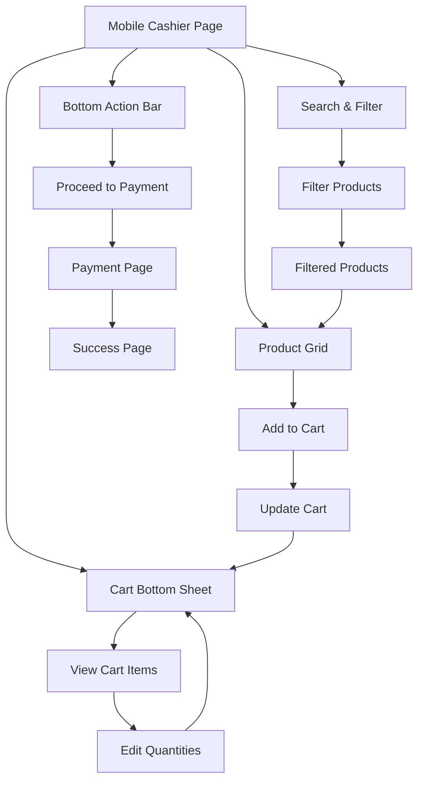

# Mobile Cashier Implementation

## Overview

Dokumen ini menjelaskan implementasi mobile view untuk modul Cashier (POS) di Ourbit POS. Mobile cashier dirancang untuk memberikan pengalaman transaksi yang optimal pada perangkat mobile dengan layout yang disesuaikan untuk touch interaction.

## Komponen & Arsitektur

- **Main Page**: `lib/app/admin/mobile/cashier/cashier_page_mobile.dart`
- **Payment Page**: `lib/app/admin/mobile/cashier/payment/payment_page_mobile.dart`
- **Success Page**: `lib/app/admin/mobile/cashier/payment/success_page_mobile.dart`
- **BLoC**: `CashierBloc`, `PaymentBloc`
- **Navigation**: `SidebarDrawer` untuk menu utama

## UI Flow



## Layout Structure

### Main Cashier Page

#### Header

- **AppBar**: Title "Kasir" + menu drawer icon
- **Search Bar**: Full width search input dengan placeholder "Cari produk..."
- **Filter**: Dropdown untuk filter kategori

#### Product Grid

- **Grid Layout**: 3 kolom untuk mobile (responsive)
- **Product Card**:
  - Product image (circular)
  - Product name (ellipsis 1 baris)
  - Price (bold, currency format)
  - Stock indicator (chip)
- **Add Button**: Floating action button di setiap card

#### Cart Bottom Sheet

- **Trigger**: Floating action button dengan cart icon + badge
- **Content**:
  - Cart items list dengan quantity controls
  - Subtotal, tax, total calculation
  - "Lanjutkan ke Pembayaran" button
- **Behavior**: Draggable, dismissible

#### Bottom Action Bar

- **Fixed Position**: Di bagian bawah screen
- **Actions**:
  - "Lihat Keranjang" button
  - "Pembayaran" button (disabled jika cart kosong)

## Payment Flow

### Payment Page

- **Order Summary**: List items dengan quantity dan price
- **Payment Methods**: Radio button selection
- **Sales Notes**: Optional text area
- **Total Amount**: Bold display
- **Process Payment**: Primary action button

### Success Page

- **Success Animation**: Checkmark dengan animation
- **Order Details**: Summary transaksi
- **Action Buttons**:
  - "Transaksi Baru" (back to cashier)
  - "Lihat Laporan" (navigate to reports)

## Data Integration

### Product Data

```dart
// Product model integration
final products = state.products;
final sellingPrice = product.sellingPrice;
final stock = product.stock;
```

### Cart Management

```dart
// Cart integration dengan CashierBloc
context.read<CashierBloc>().add(AddToCart(product));
context.read<CashierBloc>().add(ClearCart());
```

### Payment Processing

```dart
// Payment integration dengan PaymentBloc
context.read<PaymentBloc>().add(ProcessPayment(
  cartItems: cartItems,
  subtotal: subtotal,
  tax: tax,
  total: total,
  paymentMethodId: selectedMethod,
  salesNotes: notes,
));
```

## Mobile-Specific Features

### Touch Optimization

- **Large Touch Targets**: Minimum 44px untuk buttons
- **Swipe Gestures**: Untuk cart bottom sheet
- **Haptic Feedback**: Untuk add to cart actions

### Responsive Design

- **Grid Adaptation**: 2-3 kolom berdasarkan screen width
- **Font Scaling**: Responsive text sizes
- **Padding**: Consistent mobile spacing

### Performance

- **Lazy Loading**: Products loaded on demand
- **Image Caching**: Product images cached
- **Smooth Scrolling**: Optimized list performance

## Navigation Integration

### Drawer Navigation

```dart
// SidebarDrawer integration
drawer: const SidebarDrawer(),
```

### Route Navigation

```dart
// Navigation to payment
context.go('/payment');

// Navigation to success
context.go('/success');
```

## Error Handling

### Network Errors

- **Offline Detection**: Graceful handling
- **Retry Mechanism**: Auto-retry untuk failed requests
- **User Feedback**: Clear error messages

### Validation

- **Stock Validation**: Check stock before add to cart
- **Payment Validation**: Validate payment method selection
- **Form Validation**: Required fields validation

## Testing Scenarios

### Functional Testing

1. **Product Search**: Test search functionality
2. **Add to Cart**: Test cart management
3. **Payment Flow**: Test complete payment process
4. **Navigation**: Test drawer dan route navigation

### UI Testing

1. **Responsive Layout**: Test pada berbagai screen sizes
2. **Touch Interactions**: Test tap, swipe, scroll
3. **Bottom Sheet**: Test drag behavior
4. **Animations**: Test smooth transitions

## Performance Metrics

### Load Time

- **Initial Load**: < 2 seconds
- **Product Grid**: < 1 second
- **Cart Update**: < 500ms

### Memory Usage

- **Image Cache**: Optimized untuk mobile
- **State Management**: Efficient BLoC usage
- **Dispose**: Proper cleanup

## Accessibility

### Screen Reader Support

- **Semantic Labels**: Proper accessibility labels
- **Focus Management**: Logical tab order
- **Voice Commands**: Support untuk voice navigation

### Visual Accessibility

- **High Contrast**: Support untuk high contrast mode
- **Font Scaling**: Support untuk large text
- **Color Blindness**: Color-safe design

## Future Enhancements

### Planned Features

- **Barcode Scanner**: Camera integration untuk product lookup
- **Offline Mode**: Local storage untuk offline transactions
- **Multi-language**: Support untuk multiple languages
- **Dark Mode**: Enhanced dark theme support

### Performance Improvements

- **Image Optimization**: WebP format support
- **Bundle Size**: Code splitting untuk mobile
- **Caching Strategy**: Advanced caching mechanisms
