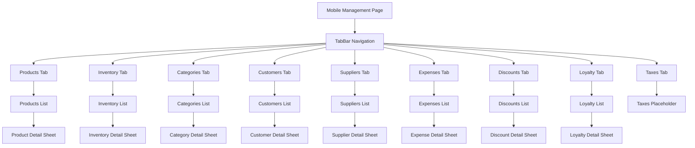

# Mobile Management Implementation

## Overview

Dokumen ini menjelaskan implementasi mobile view untuk modul Management di Ourbit POS. Mobile management menggunakan TabBar navigation untuk mengorganisir berbagai sub-modul (Products, Inventory, Categories, Customers, Suppliers, Expenses, Discounts, Loyalty, Taxes) dalam layout yang optimal untuk mobile.

## Komponen & Arsitektur

- **Main Page**: `lib/app/admin/mobile/management/management_page_mobile.dart`
- **TabBar Navigation**: Untuk sub-modul navigation
- **Content Pages**: Individual content untuk setiap modul
- **BLoC**: `ManagementBloc` untuk data management
- **Navigation**: `SidebarDrawer` untuk menu utama

## UI Flow



## Layout Structure

### Main Management Page

#### Header
- **AppBar**: Title "Data" + menu drawer icon
- **TabBar**: Scrollable tabs untuk sub-modul navigation
- **Leading**: Drawer menu button

#### TabBar Navigation
```dart
const List<Tab> tabs = [
  Tab(text: 'Produk'),
  Tab(text: 'Inventori'),
  Tab(text: 'Kategori'),
  Tab(text: 'Pelanggan'),
  Tab(text: 'Supplier'),
  Tab(text: 'Diskon'),
  Tab(text: 'Pajak'),
  Tab(text: 'Pengeluaran'),
  Tab(text: 'Loyalitas'),
];
```

#### TabBarView Content
- **Products**: `ProductsContentMobile()`
- **Inventory**: `InventoryContentMobile()`
- **Categories**: `CategoriesContentMobile()`
- **Customers**: `CustomersContentMobile()`
- **Suppliers**: `SuppliersContentMobile()`
- **Expenses**: `ExpensesContentMobile()`
- **Discounts**: `DiscountsContentMobile()`
- **Loyalty**: `LoyaltyContentMobile()`
- **Taxes**: `TaxesContentMobile()` (placeholder)

## Content Page Patterns

### Common Structure
Setiap content page mengikuti pattern yang sama:

#### Header Section
- **Search Bar**: Full width search input
- **Filter Options**: Dropdown atau chip filters (jika ada)

#### List Section
- **List-Card Layout**: Menggantikan desktop table
- **Card Components**:
  - Main content (name, description, etc.)
  - Status indicators (chips, badges)
  - Action buttons (view, edit, delete)

#### Detail Bottom Sheet
- **Trigger**: Tap pada card item
- **Content**: Detailed information dengan actions
- **Actions**: Edit, Delete, atau specific actions

### Products Content

#### List Layout
```dart
// Product card structure
OurbitCard(
  child: ListTile(
    leading: CircleAvatar(child: Icon(Icons.inventory)),
    title: Text(product.name),
    subtitle: Text(product.code ?? '—'),
    trailing: Column(
      children: [
        Text('Rp ${product.sellingPrice}'),
        Chip(label: Text(status)),
      ],
    ),
    onTap: () => _showProductDetail(product),
  ),
)
```

#### Search & Filter
- **Search**: By name, code, description
- **Category Filter**: Dropdown dengan "Semua Kategori"

#### Detail Sheet
- **Product Info**: Name, code, category, description
- **Pricing**: Selling price, purchase price
- **Stock Info**: Current stock, min stock
- **Actions**: Edit, Delete, Update Stock

### Inventory Content

#### Special Features
- **Stock Status**: Visual indicators (Normal, Menipis, Habis)
- **Stock Update**: Quick update dialog
- **Category Filter**: Filter by product category
- **Search**: By product name or code

#### Status Indicators
```dart
// Status color coding
Color statusColor = _getStatusColor(status);
Container(
  decoration: BoxDecoration(
    color: statusColor.withValues(alpha: 0.1),
    borderRadius: BorderRadius.circular(12),
    border: Border.all(color: statusColor),
  ),
  child: Text(_getStatusText(status)),
)
```

### Customers Content

#### List Features
- **Customer Info**: Name, email, phone
- **Status Badge**: Active/Inactive indicator
- **Contact Info**: Email dan phone display

#### Search
- **Multi-field**: Search by name, email, phone
- **Real-time**: Filter as you type

### Categories Content

#### Simple Layout
- **Category Name**: Primary display
- **Description**: Secondary text
- **Product Count**: Number of products in category

## Data Integration

### BLoC Integration
```dart
// ManagementBloc integration
BlocBuilder<ManagementBloc, ManagementState>(
  builder: (context, state) {
    if (state is ProductsLoaded) {
      return _buildProductsList(state.products);
    }
    return const Center(child: CircularProgressIndicator());
  },
)
```

### Supabase Integration
```dart
// Direct Supabase calls untuk organization content
final stores = await Supabase.instance.client
    .from('stores')
    .select()
    .eq('business_id', businessId);
```

## Mobile-Specific Features

### Touch Optimization
- **Card Taps**: Large touch targets untuk navigation
- **Swipe Actions**: Future enhancement untuk quick actions
- **Pull to Refresh**: Refresh data dengan pull gesture

### Responsive Design
- **List Adaptation**: Optimal untuk mobile scrolling
- **Card Sizing**: Consistent card heights
- **Text Scaling**: Responsive text sizes

### Performance
- **Lazy Loading**: Content loaded per tab
- **Image Optimization**: Efficient image loading
- **State Management**: Efficient BLoC usage

## Navigation Integration

### Drawer Navigation
```dart
// SidebarDrawer integration
drawer: const SidebarDrawer(),
```

### Tab Navigation
```dart
// TabBar integration
DefaultTabController(
  length: tabs.length,
  child: Scaffold(
    appBar: AppBar(
      bottom: TabBar(isScrollable: true, tabs: tabs),
    ),
    body: TabBarView(children: [
      const ProductsContentMobile(),
      const InventoryContentMobile(),
      // ... other tabs
    ]),
  ),
)
```

## Error Handling

### Network Errors
- **Loading States**: Proper loading indicators
- **Error Messages**: User-friendly error display
- **Retry Mechanism**: Retry buttons untuk failed operations

### Data Validation
- **Empty States**: Proper empty state handling
- **Search Results**: "No results found" messages
- **Form Validation**: Input validation untuk forms

## Testing Scenarios

### Functional Testing
1. **Tab Navigation**: Test tab switching
2. **Search & Filter**: Test search functionality
3. **Detail Sheets**: Test bottom sheet interactions
4. **Data Loading**: Test data fetching per tab

### UI Testing
1. **Responsive Layout**: Test pada berbagai screen sizes
2. **Touch Interactions**: Test card taps dan gestures
3. **Tab Scrolling**: Test horizontal tab scrolling
4. **Bottom Sheets**: Test sheet behavior

## Performance Metrics

### Load Time
- **Initial Load**: < 2 seconds
- **Tab Switching**: < 500ms
- **Search Results**: < 300ms

### Memory Usage
- **Tab State**: Efficient state management
- **Image Loading**: Optimized image handling
- **List Rendering**: Efficient list performance

## Accessibility

### Screen Reader Support
- **Tab Labels**: Proper accessibility labels
- **Card Content**: Semantic content structure
- **Action Buttons**: Clear action descriptions

### Visual Accessibility
- **High Contrast**: Color-safe design
- **Font Scaling**: Support untuk large text
- **Touch Targets**: Minimum 44px touch targets

## Future Enhancements

### Planned Features
- **Swipe Actions**: Quick edit/delete dengan swipe
- **Bulk Operations**: Multi-select untuk bulk actions
- **Offline Support**: Local caching untuk offline access
- **Advanced Filters**: More sophisticated filtering options

### Performance Improvements
- **Virtual Scrolling**: Untuk large datasets
- **Image Caching**: Advanced image caching
- **State Persistence**: Tab state persistence
