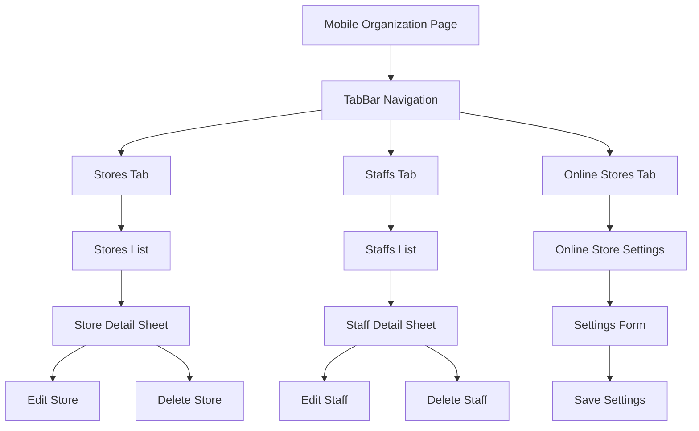

# Mobile Organization Implementation

## Overview

Dokumen ini menjelaskan implementasi mobile view untuk modul Organization di Ourbit POS. Mobile organization menggunakan TabBar navigation untuk mengorganisir sub-modul (Stores, Staffs, Online Stores) dengan layout yang optimal untuk mobile dan integrasi langsung dengan Supabase.

## Komponen & Arsitektur

- **Main Page**: `lib/app/admin/mobile/organization/organization_page_mobile.dart`
- **TabBar Navigation**: Untuk sub-modul navigation
- **Content Pages**: Individual content untuk setiap modul
- **Direct Supabase Integration**: Tanpa BLoC untuk organization
- **Navigation**: `SidebarDrawer` untuk menu utama

## UI Flow



## Layout Structure

### Main Organization Page

#### Header

- **AppBar**: Title "Organisasi" + menu drawer icon
- **TabBar**: Scrollable tabs untuk sub-modul navigation
- **Leading**: Drawer menu button

#### TabBar Navigation

```dart
const List<Tab> tabs = [
  Tab(text: 'Toko'),
  Tab(text: 'Staff'),
  Tab(text: 'Toko Online'),
];
```

#### TabBarView Content

- **Stores**: `StoresContentMobile()`
- **Staffs**: `StaffsContentMobile()`
- **Online Stores**: `OnlineStoresContentMobile()`

## Content Page Patterns

### Stores Content

#### List Layout

```dart
// Store card structure
OurbitCard(
  child: ListTile(
    leading: CircleAvatar(child: Icon(Icons.store)),
    title: Text(store['name']),
    subtitle: Text(store['business_field'] ?? '—'),
    trailing: Column(
      children: [
        Text(store['address'] ?? '—'),
        Chip(label: Text(store['is_branch'] ? 'Cabang' : 'Pusat')),
      ],
    ),
    onTap: () => _showStoreDetail(store),
  ),
)
```

#### Search & Filter

- **Search**: By store name, address, business field
- **Real-time**: Filter as you type

#### Detail Bottom Sheet

- **Store Info**: Name, address, business field
- **Contact Info**: Phone number with country code
- **Settings**: Stock setting, currency, tax rate
- **Actions**: Edit, Delete

### Staffs Content

#### List Layout

```dart
// Staff card structure
OurbitCard(
  child: ListTile(
    leading: CircleAvatar(child: Icon(Icons.person)),
    title: Text(staff['name']),
    subtitle: Text(staff['email'] ?? '—'),
    trailing: Column(
      children: [
        Text(staff['role_name'] ?? '—'),
        Text(DateFormat('dd/MM/yyyy').format(DateTime.parse(staff['created_at']))),
      ],
    ),
    onTap: () => _showStaffDetail(staff),
  ),
)
```

#### Data Integration

```dart
// Complex query untuk staff data
final staffData = await Supabase.instance.client
    .from('role_assignments')
    .select('''
      *,
      roles(name),
      users(name, email, created_at)
    ''')
    .eq('business_id', businessId);
```

#### Detail Bottom Sheet

- **Staff Info**: Name, email, role
- **Assignment Info**: Role details, assignment date
- **Actions**: Edit, Delete

### Online Stores Content

#### Form Layout

```dart
// Settings form structure
Column(
  children: [
    OurbitSwitchBuilder.withLabel(
      label: 'Aktifkan Toko Online',
      value: _isOnlineActive,
      onChanged: (value) => setState(() => _isOnlineActive = value),
    ),
    OurbitTextInput(
      controller: _subdomainController,
      placeholder: 'Subdomain (contoh: toko-saya)',
      label: 'Subdomain',
    ),
    // ... other fields
  ],
)
```

#### Settings Management

- **Online Store Toggle**: Enable/disable online store
- **Subdomain**: Custom subdomain setting
- **Contact Email**: Store contact information
- **Description**: Store description
- **Social Media**: Social media links
- **Stock Tracking**: Stock tracking preferences

#### Delivery Locations

- **Stores Toggle**: Enable delivery for specific stores
- **Warehouses Toggle**: Enable delivery for warehouses
- **Real-time Updates**: Immediate toggle updates

## Data Integration

### Direct Supabase Integration

```dart
// Stores data
final stores = await Supabase.instance.client
    .from('stores')
    .select()
    .eq('business_id', businessId);

// Staff data dengan join
final staffData = await Supabase.instance.client
    .from('role_assignments')
    .select('''
      *,
      roles(name),
      users(name, email, created_at)
    ''')
    .eq('business_id', businessId);

// Online store settings
final settings = await Supabase.instance.client
    .from('business_online_settings')
    .select()
    .eq('business_id', businessId)
    .single();
```

### Business Data Integration

```dart
// Get business data dari local storage
final businessData = await LocalStorageService.getBusinessData();
final businessId = businessData['id'];
```

## Mobile-Specific Features

### Touch Optimization

- **Card Taps**: Large touch targets untuk navigation
- **Toggle Switches**: Easy toggle untuk settings
- **Form Inputs**: Optimized input fields untuk mobile

### Responsive Design

- **List Adaptation**: Optimal untuk mobile scrolling
- **Form Layout**: Vertical layout untuk forms
- **Text Scaling**: Responsive text sizes

### Performance

- **Direct Queries**: Efficient Supabase queries
- **State Management**: Local state untuk forms
- **Real-time Updates**: Immediate UI updates

## Navigation Integration

### Drawer Navigation

```dart
// SidebarDrawer integration
drawer: const SidebarDrawer(),
```

### Tab Navigation

```dart
// TabBar integration
DefaultTabController(
  length: tabs.length,
  child: Scaffold(
    appBar: AppBar(
      bottom: TabBar(isScrollable: true, tabs: tabs),
    ),
    body: TabBarView(children: [
      const StoresContentMobile(),
      const StaffsContentMobile(),
      const OnlineStoresContentMobile(),
    ]),
  ),
)
```

## Error Handling

### Network Errors

- **Loading States**: Proper loading indicators
- **Error Messages**: User-friendly error display
- **Retry Mechanism**: Retry buttons untuk failed operations

### Data Validation

- **Empty States**: Proper empty state handling
- **Search Results**: "No results found" messages
- **Form Validation**: Input validation untuk forms

### Null Safety

```dart
// Proper null handling
Text(store['name'] ?? '—'),
Text(staff['email'] ?? '—'),
```

## Testing Scenarios

### Functional Testing

1. **Tab Navigation**: Test tab switching
2. **Search & Filter**: Test search functionality
3. **Detail Sheets**: Test bottom sheet interactions
4. **Form Submission**: Test settings form
5. **Toggle Actions**: Test delivery toggles

### UI Testing

1. **Responsive Layout**: Test pada berbagai screen sizes
2. **Touch Interactions**: Test card taps dan gestures
3. **Form Interactions**: Test form inputs dan validation
4. **Toggle Switches**: Test switch interactions

## Performance Metrics

### Load Time

- **Initial Load**: < 2 seconds
- **Tab Switching**: < 500ms
- **Search Results**: < 300ms
- **Form Submission**: < 1 second

### Memory Usage

- **Tab State**: Efficient state management
- **Form State**: Local state management
- **Query Optimization**: Efficient Supabase queries

## Accessibility

### Screen Reader Support

- **Tab Labels**: Proper accessibility labels
- **Card Content**: Semantic content structure
- **Form Labels**: Clear form field labels
- **Toggle Labels**: Descriptive toggle labels

### Visual Accessibility

- **High Contrast**: Color-safe design
- **Font Scaling**: Support untuk large text
- **Touch Targets**: Minimum 44px touch targets

## Security Considerations

### Data Access

- **Business Scoping**: All queries scoped to business_id
- **Role-based Access**: Staff data filtered by business
- **Input Validation**: Form input validation

### Error Handling

- **Sensitive Data**: No sensitive data in error messages
- **Logging**: Proper error logging without sensitive info

## Future Enhancements

### Planned Features

- **Staff Management**: Add new staff functionality
- **Store Management**: Add new store functionality
- **Advanced Settings**: More online store configuration
- **Bulk Operations**: Bulk staff/store management

### Performance Improvements

- **Caching**: Local caching untuk frequently accessed data
- **Optimistic Updates**: UI updates before server confirmation
- **Offline Support**: Offline data access
- **Real-time Sync**: Real-time data synchronization

## Integration Points

### External Services

- **Online Store**: Integration dengan online store platform
- **Email Service**: Contact email integration
- **Social Media**: Social media link validation

### Internal Systems

- **Inventory**: Stock tracking integration
- **Sales**: Store-specific sales data
- **Reports**: Store/staff-specific reporting
