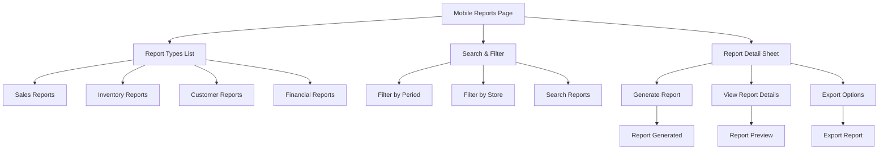

# Mobile Reports Implementation

## Overview

Dokumen ini menjelaskan implementasi mobile view untuk modul Reports di Ourbit POS. Mobile reports menyediakan interface untuk melihat dan generate berbagai jenis laporan dengan layout yang optimal untuk mobile dan filter yang mudah digunakan.

## Komponen & Arsitektur

- **Main Page**: `lib/app/admin/mobile/reports/reports_page_mobile.dart`
- **Report Types**: Various report type definitions
- **Filter System**: Period, store, dan report type filters
- **Bottom Sheet**: Report generation interface
- **Navigation**: `SidebarDrawer` untuk menu utama

## UI Flow



## Layout Structure

### Main Reports Page

#### Header

- **AppBar**: Title "Laporan" + menu drawer icon
- **Leading**: Drawer menu button

#### Search & Filter Section

```dart
// Search and filter section
Column(
  children: [
    material.TextField(
      decoration: const material.InputDecoration(
        hintText: 'Cari laporan...',
        prefixIcon: material.Icon(material.Icons.search),
        border: material.OutlineInputBorder(),
      ),
      onChanged: (value) => setState(() => _query = value),
    ),
    const material.SizedBox(height: 12),
    material.Row(
      children: [
        material.Expanded(
          child: material.DropdownButtonFormField<String>(
            value: _selectedPeriod,
            decoration: const material.InputDecoration(
              labelText: 'Periode',
              border: material.OutlineInputBorder(),
            ),
            items: _periodOptions.map((period) =>
              material.DropdownMenuItem(
                value: period['value'],
                child: material.Text(period['label']),
              ),
            ).toList(),
            onChanged: (value) => setState(() => _selectedPeriod = value!),
          ),
        ),
        const material.SizedBox(width: 12),
        material.Expanded(
          child: material.DropdownButtonFormField<String>(
            value: _selectedStore,
            decoration: const material.InputDecoration(
              labelText: 'Toko',
              border: material.OutlineInputBorder(),
            ),
            items: _storeOptions.map((store) =>
              material.DropdownMenuItem(
                value: store['value'],
                child: material.Text(store['label']),
              ),
            ).toList(),
            onChanged: (value) => setState(() => _selectedStore = value!),
          ),
        ),
      ],
    ),
  ],
)
```

#### Report Types List

```dart
// Report types list
material.ListView.separated(
  itemCount: filteredReports.length,
  separatorBuilder: (_, __) => const material.SizedBox(height: 8),
  itemBuilder: (context, index) {
    final report = filteredReports[index];
    return OurbitCard(
      child: material.ListTile(
        leading: material.CircleAvatar(
          backgroundColor: material.Colors.blue.shade50,
          child: material.Icon(
            report['icon'],
            color: material.Colors.blue,
          ),
        ),
        title: material.Text(
          report['name'],
          style: const material.TextStyle(fontWeight: material.FontWeight.w600),
        ),
        subtitle: material.Text(report['description']),
        trailing: material.Icon(material.Icons.arrow_forward_ios),
        onTap: () => _showReportDetail(report),
      ),
    );
  },
)
```

## Report Types

### Sales Reports

```dart
const salesReports = [
  {
    'id': 'sales_summary',
    'name': 'Ringkasan Penjualan',
    'description': 'Laporan ringkasan penjualan harian/bulanan',
    'icon': material.Icons.trending_up,
    'category': 'sales',
  },
  {
    'id': 'sales_by_product',
    'name': 'Penjualan per Produk',
    'description': 'Laporan penjualan berdasarkan produk',
    'icon': material.Icons.inventory,
    'category': 'sales',
  },
  {
    'id': 'sales_by_category',
    'name': 'Penjualan per Kategori',
    'description': 'Laporan penjualan berdasarkan kategori',
    'icon': material.Icons.category,
    'category': 'sales',
  },
];
```

### Inventory Reports

```dart
const inventoryReports = [
  {
    'id': 'stock_summary',
    'name': 'Ringkasan Stok',
    'description': 'Laporan stok saat ini dan pergerakan',
    'icon': material.Icons.inventory_2,
    'category': 'inventory',
  },
  {
    'id': 'low_stock',
    'name': 'Stok Menipis',
    'description': 'Produk dengan stok di bawah minimum',
    'icon': material.Icons.warning,
    'category': 'inventory',
  },
  {
    'id': 'stock_movement',
    'name': 'Pergerakan Stok',
    'description': 'Laporan masuk dan keluar stok',
    'icon': material.Icons.swap_horiz,
    'category': 'inventory',
  },
];
```

### Customer Reports

```dart
const customerReports = [
  {
    'id': 'customer_summary',
    'name': 'Ringkasan Pelanggan',
    'description': 'Laporan data dan aktivitas pelanggan',
    'icon': material.Icons.people,
    'category': 'customer',
  },
  {
    'id': 'top_customers',
    'name': 'Pelanggan Teratas',
    'description': 'Pelanggan dengan transaksi tertinggi',
    'icon': material.Icons.star,
    'category': 'customer',
  },
];
```

### Financial Reports

```dart
const financialReports = [
  {
    'id': 'revenue_summary',
    'name': 'Ringkasan Pendapatan',
    'description': 'Laporan pendapatan dan profit',
    'icon': material.Icons.attach_money,
    'category': 'financial',
  },
  {
    'id': 'expense_summary',
    'name': 'Ringkasan Pengeluaran',
    'description': 'Laporan pengeluaran dan biaya',
    'icon': material.Icons.money_off,
    'category': 'financial',
  },
];
```

## Detail Bottom Sheet

### Report Detail Interface

```dart
// Report detail bottom sheet
material.showModalBottomSheet(
  context: context,
  isScrollControlled: true,
  builder: (context) => material.Container(
    padding: const material.EdgeInsets.all(16),
    child: material.Column(
      mainAxisSize: material.MainAxisSize.min,
      crossAxisAlignment: material.CrossAxisAlignment.start,
      children: [
        material.Row(
          children: [
            material.CircleAvatar(
              backgroundColor: material.Colors.blue.shade50,
              child: material.Icon(
                report['icon'],
                color: material.Colors.blue,
              ),
            ),
            const material.SizedBox(width: 12),
            material.Expanded(
              child: material.Column(
                crossAxisAlignment: material.CrossAxisAlignment.start,
                children: [
                  material.Text(
                    report['name'],
                    style: const material.TextStyle(
                      fontSize: 18,
                      fontWeight: material.FontWeight.bold,
                    ),
                  ),
                  material.Text(
                    report['description'],
                    style: material.TextStyle(
                      color: material.Colors.grey[600],
                    ),
                  ),
                ],
              ),
            ),
          ],
        ),
        const material.SizedBox(height: 16),
        material.Text(
          'Parameter Laporan',
          style: material.Theme.of(context).textTheme.titleSmall,
        ),
        const material.SizedBox(height: 8),
        material.Text('Periode: ${_getPeriodLabel(_selectedPeriod)}'),
        material.Text('Toko: ${_getStoreLabel(_selectedStore)}'),
        const material.SizedBox(height: 16),
        material.Row(
          children: [
            material.Expanded(
              child: OurbitButton.outline(
                onPressed: () => material.Navigator.of(context).pop(),
                label: 'Batal',
              ),
            ),
            const material.SizedBox(width: 12),
            material.Expanded(
              child: OurbitButton.primary(
                onPressed: () => _generateReport(report),
                label: 'Generate Laporan',
              ),
            ),
          ],
        ),
      ],
    ),
  ),
)
```

## Filter System

### Period Filter

```dart
const periodOptions = [
  {'value': 'today', 'label': 'Hari Ini'},
  {'value': 'yesterday', 'label': 'Kemarin'},
  {'value': 'week', 'label': 'Minggu Ini'},
  {'value': 'month', 'label': 'Bulan Ini'},
  {'value': 'quarter', 'label': 'Kuartal Ini'},
  {'value': 'year', 'label': 'Tahun Ini'},
  {'value': 'custom', 'label': 'Kustom'},
];
```

### Store Filter

```dart
const storeOptions = [
  {'value': 'all', 'label': 'Semua Toko'},
  {'value': 'store_1', 'label': 'Toko Pusat'},
  {'value': 'store_2', 'label': 'Toko Cabang 1'},
  {'value': 'store_3', 'label': 'Toko Cabang 2'},
];
```

### Search Filter

```dart
// Search functionality
final filtered = reports.where((report) {
  final name = report['name'].toString().toLowerCase();
  final description = report['description'].toString().toLowerCase();
  final category = report['category'].toString().toLowerCase();
  final query = _query.toLowerCase();

  return name.contains(query) ||
         description.contains(query) ||
         category.contains(query);
}).toList();
```

## Data Integration

### Report Generation

```dart
// Report generation function
Future<void> _generateReport(Map<String, dynamic> report) async {
  try {
    // Show loading
    material.ScaffoldMessenger.of(context).showSnackBar(
      material.SnackBar(
        content: material.Text('Menggenerate laporan...'),
        backgroundColor: material.Colors.blue,
      ),
    );

    // Generate report logic here
    // This would typically call a backend service or local function

    // Show success
    material.ScaffoldMessenger.of(context).showSnackBar(
      material.SnackBar(
        content: material.Text('Laporan berhasil digenerate'),
        backgroundColor: material.Colors.green,
      ),
    );

    material.Navigator.of(context).pop();
  } catch (e) {
    // Show error
    material.ScaffoldMessenger.of(context).showSnackBar(
      material.SnackBar(
        content: material.Text('Gagal generate laporan'),
        backgroundColor: material.Colors.red,
      ),
    );
  }
}
```

## Mobile-Specific Features

### Touch Optimization

- **Card Taps**: Large touch targets untuk navigation
- **Filter Controls**: Easy-to-use dropdown controls
- **Bottom Sheet**: Draggable detail interface

### Responsive Design

- **List Adaptation**: Optimal untuk mobile scrolling
- **Filter Layout**: Responsive filter controls
- **Text Scaling**: Responsive text sizes

### Performance

- **Lazy Loading**: Report types loaded efficiently
- **Search Optimization**: Real-time search filtering
- **State Management**: Efficient local state management

## Navigation Integration

### Drawer Navigation

```dart
// SidebarDrawer integration
drawer: const SidebarDrawer(),
```

### Route Navigation

```dart
// Navigation to other sections
context.go('/pos'); // Back to cashier
context.go('/management'); // To management
```

## Error Handling

### Network Errors

- **Loading States**: Proper loading indicators
- **Error Messages**: User-friendly error display
- **Retry Mechanism**: Retry buttons untuk failed operations

### Data Validation

- **Empty States**: Proper empty state handling
- **Search Results**: "No results found" messages
- **Filter Validation**: Validate filter selections

## Testing Scenarios

### Functional Testing

1. **Search & Filter**: Test search dan filter functionality
2. **Report Selection**: Test report type selection
3. **Detail Sheet**: Test bottom sheet interactions
4. **Report Generation**: Test report generation process

### UI Testing

1. **Responsive Layout**: Test pada berbagai screen sizes
2. **Touch Interactions**: Test card taps dan gestures
3. **Filter Controls**: Test dropdown interactions
4. **Bottom Sheets**: Test sheet behavior

## Performance Metrics

### Load Time

- **Initial Load**: < 2 seconds
- **Search Results**: < 300ms
- **Filter Updates**: < 200ms
- **Report Generation**: < 5 seconds

### Memory Usage

- **Report List**: Efficient list rendering
- **Filter State**: Local state management
- **Search State**: Optimized search state

## Accessibility

### Screen Reader Support

- **Report Names**: Proper accessibility labels
- **Filter Controls**: Clear filter descriptions
- **Action Buttons**: Descriptive button labels

### Visual Accessibility

- **High Contrast**: Color-safe design
- **Font Scaling**: Support untuk large text
- **Touch Targets**: Minimum 44px touch targets

## Future Enhancements

### Planned Features

- **Report Templates**: Custom report templates
- **Scheduled Reports**: Automated report generation
- **Export Options**: PDF, Excel export
- **Report Sharing**: Share reports via email/cloud

### Performance Improvements

- **Caching**: Cache generated reports
- **Background Generation**: Background report processing
- **Offline Support**: Offline report access
- **Real-time Updates**: Real-time report data

## Integration Points

### External Services

- **Report Engine**: Backend report generation service
- **Export Service**: PDF/Excel export service
- **Email Service**: Report sharing via email

### Internal Systems

- **Sales Data**: Integration dengan sales system
- **Inventory Data**: Integration dengan inventory system
- **Customer Data**: Integration dengan customer system
