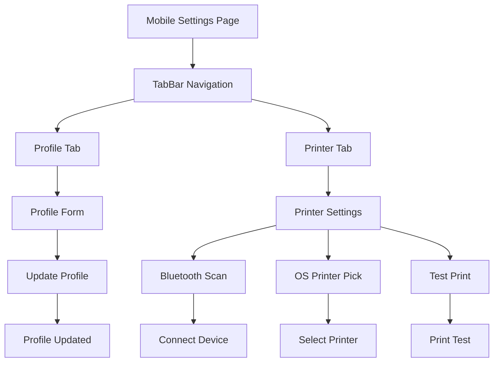

# Mobile Settings Implementation

## Overview

Dokumen ini menjelaskan implementasi mobile view untuk modul Settings di Ourbit POS. Mobile settings menggunakan TabBar navigation untuk mengorganisir sub-modul (Profile, Printer) dengan layout yang optimal untuk mobile dan integrasi dengan berbagai services.

## Komponen & Arsitektur

- **Main Page**: `lib/app/admin/mobile/settings/settings_page_mobile.dart`
- **TabBar Navigation**: Untuk sub-modul navigation
- **Content Pages**: Individual content untuk setiap modul
- **Services Integration**: Supabase Auth, Bluetooth Print, Printing
- **Navigation**: `SidebarDrawer` untuk menu utama

## UI Flow



## Layout Structure

### Main Settings Page

#### Header

- **AppBar**: Title "Pengaturan" + menu drawer icon
- **TabBar**: Scrollable tabs untuk sub-modul navigation
- **Leading**: Drawer menu button

#### TabBar Navigation

```dart
const List<Tab> tabs = [
  Tab(text: 'Profil'),
  Tab(text: 'Printer'),
];
```

#### TabBarView Content

- **Profile**: `ProfileContentMobile()`
- **Printer**: `PrinterContentMobile()`

## Content Page Patterns

### Profile Content

#### Form Layout

```dart
// Profile form structure
Column(
  children: [
    material.TextField(
      controller: _nameController,
      decoration: const material.InputDecoration(
        labelText: 'Nama',
        border: material.OutlineInputBorder(),
      ),
    ),
    const material.SizedBox(height: 12),
    material.TextField(
      controller: _emailController,
      decoration: const material.InputDecoration(
        labelText: 'Email',
        border: material.OutlineInputBorder(),
      ),
      enabled: false, // Email tidak bisa diubah
    ),
    const material.SizedBox(height: 12),
    material.TextField(
      controller: _phoneController,
      decoration: const material.InputDecoration(
        labelText: 'Telepon',
        border: material.OutlineInputBorder(),
      ),
    ),
    const material.SizedBox(height: 24),
    OurbitButton.primary(
      onPressed: _saveProfile,
      label: 'Simpan Perubahan',
    ),
  ],
)
```

#### Data Integration

```dart
// Load profile data
final user = Supabase.instance.client.auth.currentUser;
if (user != null) {
  _userId = user.id;
  _nameController.text = user.userMetadata?['name'] ?? '';
  _emailController.text = user.email ?? '';
  _phoneController.text = user.userMetadata?['phone'] ?? '';
}

// Save profile data
await Supabase.instance.client.auth.updateUser(
  UserAttributes(
    data: {
      'name': _nameController.text.trim(),
      'phone': _phoneController.text.trim(),
    },
  ),
);
```

#### Form Features

- **Name Field**: Editable user name
- **Email Field**: Read-only email (cannot be changed)
- **Phone Field**: Editable phone number
- **Save Button**: Update user profile
- **Validation**: Basic form validation

### Printer Content

#### Bluetooth Section

```dart
// Bluetooth printer section
Column(
  crossAxisAlignment: material.CrossAxisAlignment.start,
  children: [
    material.Text(
      'Printer Bluetooth',
      style: material.Theme.of(context).textTheme.titleMedium,
    ),
    const material.SizedBox(height: 12),
    OurbitButton.outline(
      onPressed: _refreshDevices,
      label: _scanning ? 'Mencari...' : 'Cari Perangkat',
    ),
    const material.SizedBox(height: 12),
    // Device list
    ..._devices.map((device) => ListTile(
      title: material.Text(device.name ?? 'Unknown'),
      subtitle: material.Text(device.address ?? ''),
      trailing: _connected?.address == device.address
          ? const material.Icon(material.Icons.check, color: material.Colors.green)
          : OurbitButton.small(
              onPressed: () => _connect(device),
              label: 'Hubungkan',
            ),
    )),
  ],
)
```

#### OS Printer Section

```dart
// OS printer section
Column(
  crossAxisAlignment: material.CrossAxisAlignment.start,
  children: [
    material.Text(
      'Printer Sistem',
      style: material.Theme.of(context).textTheme.titleMedium,
    ),
    const material.SizedBox(height: 12),
    OurbitButton.outline(
      onPressed: _pickOsPrinter,
      label: 'Pilih Printer OS',
    ),
    if (_pickedOsPrinter != null) ...[
      const material.SizedBox(height: 8),
      material.Text('Dipilih: ${_pickedOsPrinter!.name}'),
    ],
  ],
)
```

#### Test Print Section

```dart
// Test print section
Column(
  crossAxisAlignment: material.CrossAxisAlignment.start,
  children: [
    material.Text(
      'Test Print',
      style: material.Theme.of(context).textTheme.titleMedium,
    ),
    const material.SizedBox(height: 12),
    OurbitButton.primary(
      onPressed: _testPrint,
      label: 'Test Print',
    ),
  ],
)
```

## Data Integration

### Supabase Auth Integration

```dart
// Profile data integration
final user = Supabase.instance.client.auth.currentUser;
await Supabase.instance.client.auth.updateUser(
  UserAttributes(data: userData),
);
```

### Bluetooth Integration

```dart
// Bluetooth print integration
final BluetoothPrint _bluetoothPrint = BluetoothPrint.instance;

// Scan devices
await _bluetoothPrint.startScan(timeout: const Duration(seconds: 4));
final list = await _bluetoothPrint.scanResults.first
    .timeout(const Duration(seconds: 6));

// Connect device
await _bluetoothPrint.connect(device);
```

### OS Printer Integration

```dart
// OS printer integration
final printer = await Printing.pickPrinter(context: context);
if (printer != null) {
  setState(() => _pickedOsPrinter = printer);
}
```

## Mobile-Specific Features

### Touch Optimization

- **Form Inputs**: Optimized input fields untuk mobile
- **Button Sizes**: Large touch targets untuk buttons
- **Device Selection**: Easy device selection interface

### Responsive Design

- **Form Layout**: Vertical layout untuk forms
- **Device List**: Scrollable device list
- **Text Scaling**: Responsive text sizes

### Performance

- **Bluetooth Scanning**: Efficient device scanning
- **Form State**: Local state management
- **Error Handling**: Graceful error handling

## Navigation Integration

### Drawer Navigation

```dart
// SidebarDrawer integration
drawer: const SidebarDrawer(),
```

### Tab Navigation

```dart
// TabBar integration
DefaultTabController(
  length: tabs.length,
  child: Scaffold(
    appBar: AppBar(
      bottom: TabBar(isScrollable: true, tabs: tabs),
    ),
    body: TabBarView(children: [
      const ProfileContentMobile(),
      const PrinterContentMobile(),
    ]),
  ),
)
```

## Error Handling

### Network Errors

- **Loading States**: Proper loading indicators
- **Error Messages**: User-friendly error display
- **Retry Mechanism**: Retry buttons untuk failed operations

### Bluetooth Errors

- **Device Not Found**: Clear error messages
- **Connection Failed**: Retry connection options
- **Permission Issues**: Permission request handling

### Form Validation

- **Required Fields**: Validation untuk required fields
- **Email Format**: Email format validation
- **Phone Format**: Phone number format validation

## Testing Scenarios

### Functional Testing

1. **Tab Navigation**: Test tab switching
2. **Profile Update**: Test profile form submission
3. **Bluetooth Scan**: Test device scanning
4. **Printer Connection**: Test printer connection
5. **Test Print**: Test print functionality

### UI Testing

1. **Responsive Layout**: Test pada berbagai screen sizes
2. **Form Interactions**: Test form inputs dan validation
3. **Device Selection**: Test device selection interface
4. **Error States**: Test error handling UI

## Performance Metrics

### Load Time

- **Initial Load**: < 2 seconds
- **Tab Switching**: < 500ms
- **Bluetooth Scan**: < 6 seconds
- **Form Submission**: < 1 second

### Memory Usage

- **Tab State**: Efficient state management
- **Form State**: Local state management
- **Bluetooth State**: Efficient device management

## Accessibility

### Screen Reader Support

- **Tab Labels**: Proper accessibility labels
- **Form Labels**: Clear form field labels
- **Button Labels**: Descriptive button labels
- **Device Names**: Clear device identification

### Visual Accessibility

- **High Contrast**: Color-safe design
- **Font Scaling**: Support untuk large text
- **Touch Targets**: Minimum 44px touch targets

## Security Considerations

### Profile Data

- **Email Protection**: Email field read-only
- **Data Validation**: Input validation untuk user data
- **Secure Updates**: Secure profile update process

### Printer Security

- **Device Validation**: Validate connected devices
- **Permission Handling**: Proper permission requests
- **Error Logging**: Secure error logging

## Platform Support

### Android

- **Bluetooth**: Full Bluetooth printer support
- **OS Printer**: Android printing service
- **Permissions**: Camera, Bluetooth permissions

### iOS

- **Bluetooth**: Full Bluetooth printer support
- **OS Printer**: iOS printing service
- **Permissions**: Bluetooth permissions

### Web

- **Bluetooth**: Web Bluetooth API support
- **OS Printer**: Browser printing support
- **Fallback**: Graceful fallback untuk unsupported features

## Future Enhancements

### Planned Features

- **Advanced Profile**: More profile fields
- **Printer Management**: Multiple printer support
- **Print Templates**: Custom print templates
- **Cloud Print**: Cloud printing integration

### Performance Improvements

- **Bluetooth Caching**: Cache discovered devices
- **Print Queue**: Print queue management
- **Offline Support**: Offline settings access
- **Auto-connect**: Auto-connect to saved printers

## Integration Points

### External Services

- **Bluetooth Service**: Bluetooth device management
- **Printing Service**: OS printing integration
- **Auth Service**: User authentication integration

### Internal Systems

- **User Management**: User profile integration
- **Printing System**: Print service integration
- **Settings Storage**: Local settings persistence
